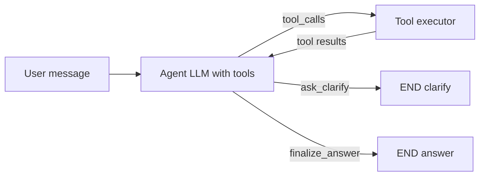

# Agentic orchestrator conversion plan

## Current baseline

- `[src/etb_project/orchestrator/app.py](src/etb_project/orchestrator/app.py)` builds `[build_rag_graph](src/etb_project/graph_rag.py)` and runs `graph.invoke` once per `POST /v1/chat`.
- `[src/etb_project/graph_rag.py](src/etb_project/graph_rag.py)`: `ingest_query` → optional `orion_gate` (parse `READY TO RETRIEVE:` via `[orion_parse.py](src/etb_project/orchestrator/orion_parse.py)`) → conditional → `retrieve_rag` (single `RemoteRetriever.invoke`) → `generate_answer`.
- Constraints today: **at most one retrieval** per user message; clarify vs retrieve is decided by **parsing** Orion free text, not structured tools.

## Target behavior (what “fully agentic” means here)

A **bounded agent loop**: the chat LLM repeatedly emits **tool calls** until it terminates with either (a) a **clarifying** user-visible message, or (b) a **final answer** produced by a dedicated generation step. This satisfies:

| Goal                         | Mechanism                                                                                                                                                           |
| ---------------------------- | ------------------------------------------------------------------------------------------------------------------------------------------------------------------- |
| Decide when to retrieve      | Model calls `retrieve` tool with a query string                                                                                                                     |
| Decide when to clarify       | Model calls `ask_clarify` (or similar) with one short question; graph ends with `phase=clarify`                                                                     |
| Forward to “generator”       | Model calls `finalize_answer` after enough context is gathered (runs current generation logic)                                                                      |
| Rich retrieval without noise | **Multiple** `retrieve` calls allowed internally; **single** user-facing reply per HTTP request; merge/dedupe chunks in state                                       |
| Do not overwhelm the user    | Hard caps: max **1** clarifying tool per turn (reject/ignore extras), max **N** retrieve calls (e.g. 3–5), max **tokens/chars** of merged context before truncation |

## Recommended implementation shape (LangGraph + tools)

Use **LangGraph’s prebuilt ReAct-style pattern** (`[langgraph.prebuilt.create_react_agent](https://langchain-ai.github.io/langgraph/)` — verify exact import for your pinned `langgraph>=0.2` in `[requirements.txt](requirements.txt)`) **or** an equivalent hand-rolled graph (`agent` → `ToolNode` → `agent`) if prebuilt APIs do not fit `BaseChatModel` from `[get_chat_llm()](src/etb_project/models.py)`.

**Tools (StructuredTool / `@tool`)** — all side effects go through these:

1. `**retrieve(query: str)`**
  - Calls existing `[RemoteRetriever.invoke](src/etb_project/remote_retriever.py)` (same HTTP contract).
  - Appends returned `Document`s into `**accumulated_docs`** in graph state (merge + **dedupe** by stable key: e.g. `metadata` chunk id if present, else hash of `page_content` prefix).
  - Returns a **short tool message** to the model: e.g. count of chunks + 1–2 line summary (not full dumps), so the context window is not blown on the next step.
2. `**ask_clarify(message: str)`**
  - Sets `route="clarify"`, `answer=message`, updates `messages` for session persistence, **ends the graph** (no further tools this turn).
  - Enforced: if clarify already used this turn, tool returns error string so the model must choose `retrieve` or `finalize_answer`.
3. `**finalize_answer()`** (no args, or optional `focus: str`)
  - Runs the same **grounded generation** as today’s `[generate_answer](src/etb_project/graph_rag.py)` but using `**rewritten_query`** (last user query or model-maintained working query) and `**accumulated_docs`** (merged, truncated).
  - Sets `route="answer"`, appends final AI message, **ends graph**.

**State schema** (extend `[RAGState](src/etb_project/graph_rag.py)` or new `AgentOrchestratorState`):

- Keep: `messages`, `query`, `rewritten_query`, `context_docs` (alias or replace with `accumulated_docs`), `answer`, `route`, `tool_calls` (audit log).
- Add: `retrieve_calls_used: int`, `clarify_used: bool`, `max_retrieve_calls: int` (from settings).

**Guardrails** (in tool implementations or a wrapper node):

- Increment `retrieve_calls_used`; if over cap, return tool error: “max retrieval steps reached—call finalize_answer or ask_clarify.”
- Increment **agent step count** each LLM turn; if `**ETB_AGENT_MAX_STEPS`** exceeded, **force `finalize_answer`** with disclaimer (see **Resolved gap decisions**, row 1).
- Execute sync `RemoteRetriever.invoke` via `**asyncio.to_thread`** from async paths (see row 3).
- If `accumulated_docs` exceeds `**ETB_AGENT_MAX_CONTEXT_CHARS**`, truncate **first-seen** order and log; see row 11.

**System prompt** (new file, e.g. `[src/etb_project/orchestrator/agent_system_prompt.py](src/etb_project/orchestrator/agent_system_prompt.py)`):

- Incorporate the **intent** of `[ORION_SYSTEM_PROMPT](src/etb_project/orchestrator/prompts.py)`: one clarifying question when critical dimensions are missing; prefer **targeted retrieval** when the ask is specific enough.
- Add **explicit priorities**: (1) If ambiguous on scope/time/metric, `ask_clarify` once. (2) If specific enough, `retrieve` with a precise query; optionally **re-query** with narrower terms if tool feedback suggests gaps. (3) When context suffices or limits hit, `finalize_answer`.
- Instruct: do **not** paste full retrieved text in assistant messages; use tools.

**Generation** — Reuse extraction helpers from `[graph_rag.py](src/etb_project/graph_rag.py)` (`_extract_text_from_ai_message`) by **moving shared helpers** to a small module (e.g. `etb_project/orchestrator/llm_messages.py`) to avoid duplication between legacy graph and agent.

## Orchestrator HTTP integration

- In `[chat()](src/etb_project/orchestrator/app.py)`: replace `build_rag_graph(...)` with `**build_agent_orchestrator_graph(...)`** (name TBD) when agent mode is on.
- Preserve: session `deserialize_messages` / `serialize_messages`, `return_sources` mapping from `context_docs`/`accumulated_docs`, `phase` from `route`.
- Add **feature flag** (recommended): `ETB_ORCHESTRATOR_AGENT=1` (default `1` after cutover) vs legacy `build_rag_graph` so you can roll back without reverting code. Document in `[docs/ARCHITECTURE.md](docs/ARCHITECTURE.md)` and orchestrator settings.

## CLI / Studio / tests

- `[src/etb_project/main.py](src/etb_project/main.py)` and `[studio_entry.py](src/etb_project/studio_entry.py)`: either switch to the agent graph with `enable_orion_gate=False` equivalent **or** keep `**build_rag_graph`** as a **simple baseline** for local CLI until agent is validated. Recommend: one shared “runtime builder” function that reads the same env flag.
- **Tests** (`[tests/test_graph_rag.py](tests/test_graph_rag.py)`): keep tests for legacy `build_rag_graph` if retained; add `**tests/test_agent_orchestrator.py`** with mocked `BaseChatModel` that returns **sequential** `AIMessage`s with `tool_calls`, then verify: retriever call counts, dedupe behavior, clarify short-circuit, finalize uses merged docs, max-step cap.
- **Dependencies**: add `langgraph` to `[pyproject.toml](pyproject.toml)` `[project].dependencies` if it is only in `requirements.txt` today (align install paths).

## API / UX surface

- `[ChatResponse](src/etb_project/orchestrator/schemas.py)`: optional `**agent_trace`** or `**retrieve_rounds: int`** for debugging (default omitted in production). Not required for MVP.
- Streamlit `[app.py](app.py)`: no contract change if `answer` + `phase` + `sources` stay stable; verify empty sources on clarify-only turns.

## Documentation and workspace rules

- Update `[docs/ARCHITECTURE.md](docs/ARCHITECTURE.md)` with the agent loop diagram and env vars.
- Update root `[README.md](README.md)` orchestrator section when execution/env vars change (per workspace rule).
- Log the planning prompt in `[PROMPTS.md](PROMPTS.md)` when implementation work is done (per workspace rule).

## Risk notes

- **Tool-calling support**: `ChatOpenAI` supports native tools; `ChatOllama` may be weaker—document requirement or add JSON fallback for `ETB_LLM_PROVIDER=ollama` if needed.
- **Latency/cost**: more LLM rounds per message; caps mitigate.
- **Determinism**: tests should mock tool-calling responses, not rely on live models.

## Resolved gap decisions (formerly 12 open items)

User-confirmed choices: **retriever I/O** = wrap sync `[RemoteRetriever.invoke](src/etb_project/remote_retriever.py)` in `**asyncio.to_thread`** for MVP (no new async client class required initially). **Max agent steps exceeded** = `**finalize_answer` with merged docs** plus a **short disclaimer** in the assistant text (HTTP 200; do not return 502 for step limit).

| #   | Gap                               | Resolution                                                                                                                                                                                                                                                                                                                                                                                                                                                                                                                                                                                                                                                                                                                                                            |
| --- | --------------------------------- | --------------------------------------------------------------------------------------------------------------------------------------------------------------------------------------------------------------------------------------------------------------------------------------------------------------------------------------------------------------------------------------------------------------------------------------------------------------------------------------------------------------------------------------------------------------------------------------------------------------------------------------------------------------------------------------------------------------------------------------------------------------------- |
| 1   | **Graph termination / recursion** | Two caps: `**ETB_AGENT_MAX_RETRIEVE`** (default e.g. 4) and `**ETB_AGENT_MAX_STEPS`** (default e.g. 10 LLM turns including tool rounds). When **max steps** is hit: run `**finalize_answer`** once with current `accumulated_docs` (may be empty) and prepend/append a fixed disclaimer line that the answer may be incomplete due to step limits. When **max retrieve** is hit: tool returns error string; model must call `finalize_answer` or `ask_clarify` (not another retrieve).                                                                                                                                                                                                                                                                                |
| 2   | **Structured-tool fallback**      | If an agent turn returns **no tool_calls** (plain text only): **one** automatic **re-prompt** system message: “You must respond with tool calls only: retrieve, ask_clarify, or finalize_answer.” If the **second** turn still has no tools: **invoke `finalize_answer` logic** with the same state (use user query + any accumulated docs), log a warning `agent_tool_fallback`, and return 200. Add unit tests for both branches.                                                                                                                                                                                                                                                                                                                                   |
| 3   | **Async vs sync I/O**             | **MVP**: from async FastAPI / async graph nodes, call `await asyncio.to_thread(retriever.invoke, query)` so the event loop is not blocked during HTTP. **Follow-up (optional)**: introduce `AsyncRemoteRetriever` with `httpx.AsyncClient` if profiling shows thread overhead.                                                                                                                                                                                                                                                                                                                                                                                                                                                                                        |
| 4   | **Session / multi-turn clarify**  | No new session fields in MVP. **Rely on** existing `[session_messages](src/etb_project/orchestrator/session_messages.py)` history: after `phase=clarify`, the user’s next message is a normal `HumanMessage` in the thread. **Agent system prompt** must instruct: if the last assistant output was a clarifying question, treat the new user message as **disambiguation**—do not re-ask the same dimension unless still missing. Optional later: persist `clarification_round` in session metadata (out of scope for first ship).                                                                                                                                                                                                                                   |
| 5   | **Orion vs agent clarify**        | **Split paths**: `ETB_ORCHESTRATOR_AGENT=1` (default after cutover) uses **only** the agent graph and **structured** `ask_clarify` tool—**do not** run `orion_gate` + `parse_orion_response` on that path. `ETB_ORCHESTRATOR_AGENT=0` keeps `**build_rag_graph`** with existing Orion gate and `[parse_orion_response](src/etb_project/orchestrator/orion_parse.py)`. **Content**: fold the **policy** from `[ORION_SYSTEM_PROMPT](src/etb_project/orchestrator/prompts.py)` into the **agent system prompt** so behavior stays aligned; keep `ORION_SYSTEM_PROMPT` file for the legacy graph and docs until legacy is removed.                                                                                                                                       |
| 6   | **Observability**                 | **MVP**: structured `logger.info` lines per tool execution: `request_id`, `session_id` (if available), `tool`, `retrieve_calls_used`, `step_index`, `duration_ms`. **Out of scope MVP**: OpenTelemetry; leave a one-line extension point in ARCHITECTURE for later.                                                                                                                                                                                                                                                                                                                                                                                                                                                                                                   |
| 7   | **Operational rollout / metrics** | Same feature flag as above. **Log fields** (for grep/aggregation): `orchestrator_mode=legacy                                                                                                                                                                                                                                                                                                                                                                                                                                                                                                                                                                                                                                                                          |
| 8   | **Security & abuse**              | **Prompt injection**: generator prompt uses **clear delimiters** for retrieved chunks (e.g. `---BEGIN CONTEXT---` / `---END CONTEXT---`) and instructs the model to treat context as untrusted data. **Rate limiting**: **document** as recommended follow-up (per-IP or per-session token bucket); not blocking MVP unless product requires it.                                                                                                                                                                                                                                                                                                                                                                                                                      |
| 9   | **Streaming**                     | **Out of scope MVP**. Document in ARCHITECTURE that future SSE would stream **after** the agent loop completes unless the graph is refactored for token streaming from `finalize_answer`.                                                                                                                                                                                                                                                                                                                                                                                                                                                                                                                                                                             |
| 10  | **LangGraph state / prebuilt**    | **Spike** in implementation: try `create_react_agent` with custom state; if `accumulated_docs` or termination hooks are awkward, **default fallback** = **hand-rolled** graph: `agent` node → `ToolNode` → conditional → `agent` or `END`. Document the chosen approach in ARCHITECTURE.                                                                                                                                                                                                                                                                                                                                                                                                                                                                              |
| 11  | **Token / context budget**        | **MVP**: **character cap** on merged `accumulated_docs` text before `finalize_answer` (e.g. `**ETB_AGENT_MAX_CONTEXT_CHARS`**, default ~48_000), deterministic truncation **first-seen order** (retrieval order), log `context_truncated=true`. **Defer** `tiktoken` unless cost accuracy becomes an issue.                                                                                                                                                                                                                                                                                                                                                                                                                                                           |
| 12  | **pyproject + workspace rules**   | **Required**: add `langgraph` to `[project].dependencies` in `[pyproject.toml](pyproject.toml)` (align with `[requirements.txt](requirements.txt)`). **Tests**: new modules get pytest coverage consistent with `[tests/test_graph_rag.py](tests/test_graph_rag.py)` patterns; add cases for step limit, tool fallback, and to_thread retrieval. **FastAPI**: keep existing exception handlers and dependency style in `[orchestrator/app.py](src/etb_project/orchestrator/app.py)`; read `[.cursor/rules/py-fastapi-dev.mdc](.cursor/rules/py-fastapi-dev.mdc)` when touching routes. **Coverage rule**: if `[unit-testing-requirements.mdc](.cursor/rules/unit-testing-requirements.mdc)` is applied to the task, extend tests to cover new functions and branches. |

### Environment variables (add to orchestrator settings)

- `ETB_ORCHESTRATOR_AGENT` — `1` = agent graph (default after cutover), `0` = legacy `build_rag_graph`.
- `ETB_AGENT_MAX_RETRIEVE` — max `retrieve` tool calls per user message.
- `ETB_AGENT_MAX_STEPS` — max LLM↔tool iterations per user message.
- `ETB_AGENT_MAX_CONTEXT_CHARS` — merged context char budget for generation.
