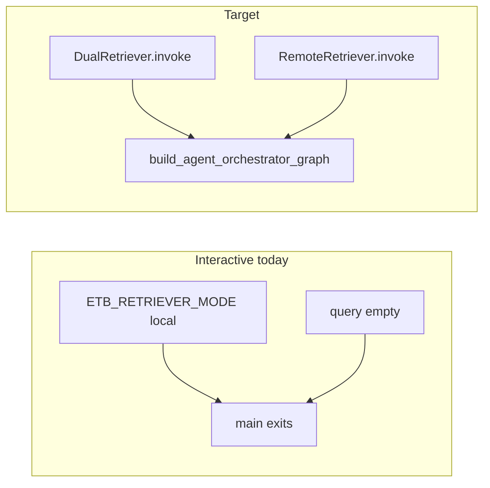

# CLI + local: parity with Web UI (remote) and CLI (remote)

## Current state

- `[src/etb_project/main.py](src/etb_project/main.py)`: With empty `query`, interactive mode **only runs when** `ETB_RETRIEVER_MODE=remote` (lines 141–148); otherwise `SystemExit`. Local mode is limited to **single-query** retrieval when `query` is non-empty.
- **Remote interactive CLI** already calls `[build_agent_orchestrator_graph](src/etb_project/orchestrator/agent_graph.py)` with `[RemoteRetriever](src/etb_project/retrieval/remote_retriever.py)` and `[get_ollama_llm()](src/etb_project/models.py)` (aliased as `get_llm`).
- **Web UI** hits the orchestrator `[POST /v1/chat](src/etb_project/orchestrator/app.py)`: same graph builder, `[get_chat_llm()](src/etb_project/models.py)` (OpenAI-compat / OpenRouter when configured), `[RemoteRetriever](src/etb_project/retrieval/remote_retriever.py)`, and **session-scoped** `messages` via `[deserialize_messages` / `serialize_messages](src/etb_project/orchestrator/session_messages.py)` and `[InMemorySessionStore](src/etb_project/orchestrator/sessions.py)`.

The agent graph’s `[ingest_node](src/etb_project/orchestrator/agent_graph.py)` appends each user `query` as a `HumanMessage` onto **prior** `messages`, then resets per-turn fields (`accumulated_docs`, etc.). So multi-turn behavior depends on passing the **previous turn’s** `messages` back in—not on the retriever being local vs remote.

## What “exact same behavior” means (layers)

| Layer               | Web UI + orchestrator            | CLI remote (today)                     | CLI local (today)                                                     |
| ------------------- | -------------------------------- | -------------------------------------- | --------------------------------------------------------------------- |
| Agent graph + tools | Yes                              | Yes                                    | **Blocked**                                                           |
| Retriever           | HTTP `RemoteRetriever`           | HTTP                                   | In-process `DualRetriever` (same `.invoke(q)` contract used by tools) |
| LLM                 | `get_chat_llm()`                 | `get_ollama_llm()`                     | N/A                                                                   |
| Multi-turn          | Session store + prior `messages` | **No** — each line uses `messages: []` | N/A                                                                   |

So “same as web UI” is **not** only “allow local interactive”: the CLI still differs on **LLM** and **conversation history** unless those are addressed.

---

## Phase A — Minimum: local interactive = same graph as remote CLI

**Goal:** Empty `query` + default/local `ETB_RETRIEVER_MODE` loads FAISS via `_build_local_retriever`, then runs the **same** `build_agent_orchestrator_graph(...)` path as remote interactive (same guardrails from `[load_orchestrator_settings()](src/etb_project/orchestrator/settings.py)`).

**Code**

1. In `[main.py](src/etb_project/main.py)`, **delete** the block that errors when `mode != "remote"` (lines 141–148).
2. Replace the single log line after building the graph with two branches: e.g. “remote HTTP retriever” vs “local DualRetriever”.

**Tests**

- Add `test_main_interactive_uses_agent_graph_with_local_retriever` in `[tests/test_main.py](tests/test_main.py)`: `ETB_RETRIEVER_MODE=local` (or unset), empty `query`, patch `_build_local_retriever` to return a mock, same assertions as `[test_main_interactive_uses_agent_graph_with_remote_retriever](tests/test_main.py)` (graph built once, `invoke` with `hello`).

**Docs**

- Update `[docs/ARCHITECTURE.md](docs/ARCHITECTURE.md)` (Main application + CLI mermaid): remove “interactive requires remote”; show local and remote both feeding the agent graph.
- Tighten `[docs/USAGE.md](docs/USAGE.md)` interactive section: describe agent tools (`retrieve` / `ask_clarify` / `finalize_answer`), not legacy node names; note local vs remote both support interactive.
- Optional README snippet: interactive with local indices (no `RETRIEVER_BASE_URL`).
- Append a timestamped entry to `[PROMPTS.md](PROMPTS.md)` per project rules.

---

## Phase B — Multi-turn parity with Web UI (recommended for “same behavior”)

**Goal:** Each stdin line behaves like a new message in the **same** session: pass `**messages` from the previous graph result** into the next `invoke`, matching orchestrator’s `prior` + new `query` pattern (`[app.py` ~257–277](src/etb_project/orchestrator/app.py)).

**Code**

- In the interactive loop in `[main.py](src/etb_project/main.py)`, initialize `messages: list = []` before the loop. After each successful `rag_graph.invoke(...)`, set `messages = result.get("messages") or []` (same object the orchestrator persists per session).
- Pass `initial = {"query": line, "messages": messages, ...}`; optionally add `session_id` (fixed string e.g. `"cli"`) and `request_id` (new `uuid` per line) for logging parity with `[agent_graph` logging](src/etb_project/orchestrator/agent_graph.py).

**Tests**

- Extend or add a test: two `input()` lines, assert second `invoke` receives non-empty `messages` in kwargs (or inspect call args) matching “history carried forward”.

---

## Phase C — LLM parity with Web UI (optional, larger product choice)

**Goal:** Optional alignment of CLI chat model with orchestrator (`get_chat_llm`) instead of always using Ollama.

**Options** (pick one when implementing):

- **C1:** Interactive CLI always uses `get_chat_llm()` (breaking change for users who only run Ollama).
- **C2:** Use `get_chat_llm()` only when `ETB_LLM_PROVIDER` / `OPENAI_API_KEY` (or similar) is set; else `get_ollama_llm()` (document in `[docs/USAGE.md](docs/USAGE.md)` / `[docs/APP_RUN_MODES.md](docs/APP_RUN_MODES.md)`).

No change to graph code; only which `BaseChatModel` is passed into `build_agent_orchestrator_graph`.

---

## Out of scope / unchanged

- **Orchestrator** remains HTTP-only for retriever (`RemoteRetriever`); no requirement to change that for this plan.
- **LangGraph Studio** (`[studio_entry.py](src/etb_project/studio_entry.py)`) can stay remote-only unless you explicitly want Studio + local FAISS later.

## Suggested implementation order

1. Phase A (unblock local + docs + tests).
2. Phase B if the requirement is true parity with Web UI conversation behavior.
3. Phase C only if you need matching models/providers, not just the same graph topology.
