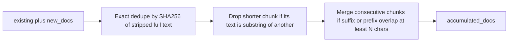

# Content-based duplicate removal for agent `accumulated_docs`

## Problem

`[_doc_dedupe_key](src/etb_project/orchestrator/agent_graph.py)` (lines 44–51) prefers `chunk_id`, then `id`, then `**source**`. When `chunk_id`/`id` are absent, **every chunk from the same file shares one `source` key**, so `_merge_documents` keeps **only the first chunk** per file—dropping text vs image/caption chunks that should stay separate.

The fallback `hash(text[:200])` is also unstable (Python `hash()` salt) and only uses a prefix.

## Approach (simple, robust)

Replace `_doc_dedupe_key` + incremental append with a **single pass over `existing + new_docs`** inside `_merge_documents`:

1. **Exact duplicates** — `hashlib.sha256(stripped_utf8_bytes).hexdigest()` per document; keep **first** occurrence order.
2. **Substring containment** — if `len(a) < len(b)` and `a in b` (after strip), **drop `a`** (removes redundant snippets without needing metadata).
3. **Consecutive boundary overlap** — for each adjacent pair in list order, if `left[-k:] == right[:k]` for `k >= 15` (constant), replace with single `Document` = `left + right[k:]`, keep first chunk’s metadata (documented in code). Handles typical sliding-window overlaps without merging unrelated chunks.

**Out of scope for this pass:** fuzzy/near-duplicate (simhash), cross-order non-consecutive overlap (higher complexity).

## Code changes

- `**[src/etb_project/orchestrator/agent_graph.py](src/etb_project/orchestrator/agent_graph.py)`**
  - Add `import hashlib`.
  - Remove `_doc_dedupe_key`.
  - Add small helpers: `_content_fingerprint`, `_filter_subsumed_by_content`, `_merge_boundary_if_overlap`, `_merge_consecutive_overlaps`, and rewrite `_merge_documents` to implement the pipeline above (module docstring on `_merge_documents`).

## Tests

- Add `**[tests/test_agent_merge_documents.py](tests/test_agent_merge_documents.py)**` (or extend `[tests/test_agent_orchestrator.py](tests/test_agent_orchestrator.py)`) by importing `_merge_documents` from `agent_graph`:
  - Same `metadata["source"]`, **different** `page_content` → **both** kept (regression).
  - Identical stripped text → one remains.
  - Shorter text contained in longer → shorter removed.
  - Two consecutive strings with shared boundary of length ≥ 15 → merged into one.

## Docs / log

- One short bullet in `[docs/ARCHITECTURE.md](docs/ARCHITECTURE.md)` under the agent/retrieve section (merge is content-based, not `source`-keyed), or a sentence in the `agent_graph` module docstring only—keep minimal per project preference.
- Append `[PROMPTS.md](PROMPTS.md)` with a timestamped entry (workspace rule).

## Verification

- `pytest tests/test_agent_orchestrator.py tests/test_agent_merge_documents.py` (or full `tests/` if quick).
- `mypy` on touched modules if CI uses it.
