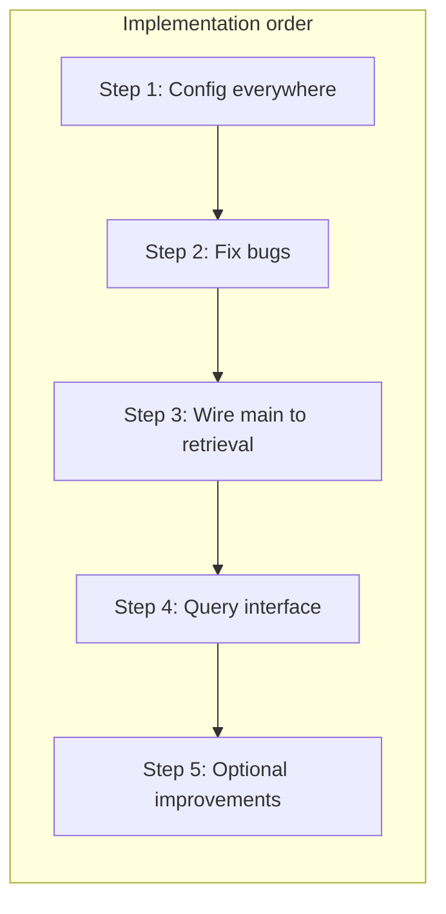

# Plan: Core RAG Pipeline Integration and Cleanup

This plan addresses each step identified from the current state of core: wiring main to retrieval, using config everywhere, adding a query interface, fixing bugs, and optional improvements.

---

## Step 1: Use config everywhere (foundation)

**Goal:** Single source of truth for PDF path, `retriever_k`, and log level so main and scripts don’t hardcode values.

- **Config loading in app code**
  - In [src/etb_project/main.py](src/etb_project/main.py): Import and call `load_config()` (from `src.config.config` or a path that works for both dev and installed runs). Resolve config path relative to project root or via env (e.g. `ETB_CONFIG`) so it works when run as `python -m etb_project.main` from repo root.
  - Apply `config.log_level` when configuring logging (e.g. `logging.getLogger().setLevel(getattr(logging, config.log_level))`).
- **Retrieval script**
  - In [src/etb_project/retrieval/process.py](src/etb_project/retrieval/process.py) `if __name__ == "__main__"`: Replace hardcoded `file_path` with `config.pdf` (require it to be set, or fallback to a default path/env). Replace `k=10` with `config.retriever_k`.
- **Config path**
  - Ensure [src/config/config.py](src/config/config.py) `load_config()` default path works when running from project root (e.g. `"src/config/settings.yaml"` or `Path(__file__).resolve().parent.parent / "config" / "settings.yaml"` depending on where `config` lives relative to the package). Document in README that `settings.yaml` (or `ETB_CONFIG`) is used.

**Outcome:** All entry points (main and process `__main`__) use `AppConfig`; no hardcoded paths or k in code.

---

## Step 2: Fix small bugs in retrieval and loader

**Goal:** Correct types, remove dead code/duplicate imports, and align loader with README or simplify.

- **process.py**
  - Remove duplicate FAISS import: keep `from langchain_community.vectorstores import FAISS`, remove `from langchain_community.vectorstores.faiss import FAISS`.
  - Fix or remove `embed_documents`: It currently returns `list[list[float]]` but is annotated `list[Document]` and is unused (FAISS embeds via `embedding_function`). Either delete it or fix the return type to `list[list[float]]` and keep it for potential reuse (e.g. tests). Prefer fix + keep for clarity.
  - Remove unused `Optional` and `BaseRetriever` imports if nothing uses them after edits.
- **loader.py**
  - [src/etb_project/retrieval/loader.py](src/etb_project/retrieval/loader.py): Either implement vision-based image description (use `LLMImageBlobParser` with `get_ollama_llm` vision model and pass to loader as in README), or remove unused imports (`get_ollama_llm`, `LLMImageBlobParser`) and add a short README note that image extraction is currently text-only. Choose one path to avoid misleading README.

**Outcome:** Clean imports, correct types, and loader behavior matches docs.

---

## Step 3: Wire main.py to the retrieval pipeline

**Goal:** One run path: load config → load PDF → build vectorstore → get retriever → run query (from config or a simple loop).

- **In main.py**
  - After loading config and setting log level, require `config.pdf` (or a default). Call `load_pdf(config.pdf)` then `process_documents(docs)` from `etb_project.retrieval.process` (or from `retrieval/__init__.py` re-exports).
  - Build retriever: `vectorstore.as_retriever(search_kwargs={"k": config.retriever_k})`.
  - If `config.query` is non-empty: run `retriever.invoke(config.query)`, log or print results. Else: either do nothing (query later via CLI/API) or start a simple interactive loop (see Step 4). Decide based on whether Step 4 is “CLI only” or “config query only”; recommend supporting both (config query for single run, optional `--interactive` or stdin loop).

**Outcome:** Running `python -m etb_project.main` loads the configured PDF, builds the index, and at least runs one query when `config.query` is set.

---

## Step 4: Add a minimal query interface

**Goal:** Users can ask questions and see retrieval results (and optionally an LLM answer) without editing code.

- **Option A – CLI only**
  - In `main.py`, after building the retriever: if no `config.query`, enter a loop: read line from stdin (e.g. `input("Query: ")`), invoke retriever, print doc contents (and optionally pass to `get_ollama_llm()` for a short answer). Exit on empty line or Ctrl+C.
- **Option B – FastAPI API**
  - Add a small FastAPI app (e.g. in `src/etb_project/api.py` or under `src/etb_project/routers/`) with an endpoint such as `POST /query` (body: `{"query": "..."}`). On first request (or on startup), load config, run `load_pdf` + `process_documents`, store retriever in app state; then invoke retriever and return chunks (and optionally an LLM-generated answer). Document how to run the API (e.g. `uvicorn etb_project.api:app`).
- **Recommendation:** Start with Option A (CLI loop in main) for simplicity; add Option B later if you want an HTTP API. Plan should list both so you can choose.

**Outcome:** A clear way to run ad-hoc queries (CLI and/or API) using the same config and pipeline.

---

## Step 5: Optional improvements

**Goal:** Persistence, clearer public API, tests, and docs.

- **Persistence**
  - After `process_documents`, optionally save FAISS index + docstore to disk (e.g. under `data/` or a path from config). On next run, if saved index exists and is newer than the PDF, load it instead of re-running `load_pdf` + `process_documents`. Use LangChain’s `vectorstore.save_local` / `FAISS.load_local` (or equivalent) and document the path in README.
- **Public API**
  - In [src/etb_project/retrieval/**init**.py](src/etb_project/retrieval/__init__.py), re-export: `load_pdf`, `process_documents`, `split_documents`, and optionally `store_documents` so callers can do `from etb_project.retrieval import load_pdf, process_documents`.
- **Tests**
  - Unit tests for: `split_documents` (e.g. chunk count/sizes), `store_documents` (mock embeddings, check FAISS has docs), `process_documents` (integration-style with small doc list), and `load_config` (valid YAML, overrides, missing file). Follow [.cursor/rules/unit-testing-requirements.mdc](.cursor/rules/unit-testing-requirements.mdc) for coverage and edge cases.
- **Documentation**
  - Update [docs/ARCHITECTURE.md](docs/ARCHITECTURE.md): Add a “RAG pipeline” section describing flow (PDF → loader → split → FAISS → retriever) and how `main.py` and config tie in. Optionally add a one-line diagram (e.g. mermaid: `Config → main → load_pdf → process_documents → retriever → query`).

**Outcome:** Optional but consistent persistence, clear retrieval API surface, tests for core behavior, and architecture docs that match the implementation.

---

## Project rules to apply

- **Git:** Create a new branch before making edits (per [.cursor/rules/git-rules.mdc](.cursor/rules/git-rules.mdc)).
- **README:** Update [README.md](README.md) when the application changes: how to set `settings.yaml` (or `ETB_CONFIG`), how to run `python -m etb_project.main`, and if you add API, how to run the FastAPI app.
- **Prompts:** Log this plan (or the user prompt that led to it) in [PROMPTS.md](PROMPTS.md) with a timestamp (per log-prompts rule).

---

## Suggested order of implementation

Execute in this order so config and bug fixes are in place before wiring main and adding the query interface; optional improvements last.
