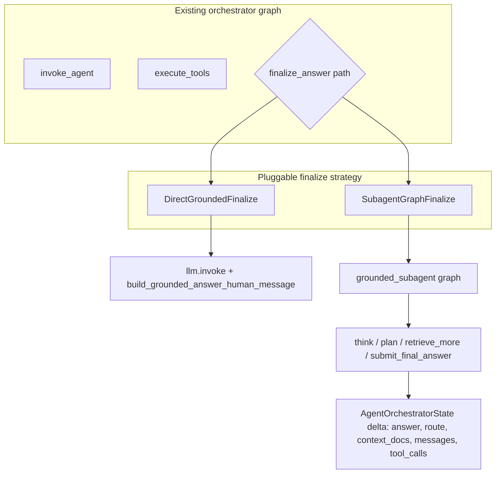

# Grounded subagent (opt-in) plan

## Goals

- Introduce a **separate package** under `[src/etb_project/grounded_subagent/](src/etb_project/grounded_subagent/)` that receives the **same logical inputs** as today’s finalize path: user question, merged `Document` list, truncation budget, optional `answer_prefix`, parent `messages` tail (for ordering), `tool_call_id` when coming from `finalize_answer`, plus correlation ids (`request_id` / `session_id`).
- Support **extensibility via templates**: system prompt + tool descriptions (and optional future Jinja/str placeholders) so you can add reasoning/planning tools without rewriting the graph.
- Allow **extra retrieval** inside the subagent with a **separate budget** from the outer agent’s `ETB_AGENT_MAX_RETRIEVE` (avoid double-counting and confusing limits).
- **Do not break the default flow**: when the feature is off, behavior matches current `[_grounded_generation_update](src/etb_project/orchestrator/agent_graph.py)` (single non-tool call, same audit fields and state keys).

## Architecture

- **Integration surface**: add an optional parameter to `[build_agent_orchestrator_graph](src/etb_project/orchestrator/agent_graph.py)`, e.g. `grounded_finalize_mode: Literal["direct", "subagent"] = "direct"`, plus writer-specific limits. When `"direct"`, keep the existing `_grounded_generation_update` implementation (either left in place or moved behind a thin function in the new package that duplicates nothing unnecessary—prefer **keep invoke logic in one place**: a `direct.py` module in `grounded_subagent` that implements the same call sequence, and have `agent_graph` import it to avoid drift, *or* keep `_grounded_generation_update` in `agent_graph` and only import the subagent graph when mode is `subagent`). **Recommended**: extract a small `**run_direct_grounded_finalize(...)`** in `grounded_subagent/direct.py` that contains today’s logic (moving `build_grounded_answer_human_message` usage + `llm.invoke` there), and thin-wrap from `agent_graph` so the orchestrator file stays smaller and tests target one implementation.
- **Settings**: extend `[OrchestratorSettings](src/etb_project/orchestrator/settings.py)` with optional fields (e.g. `grounded_finalize_mode`, `writer_max_steps`, `writer_max_retrieve`, `writer_max_context_chars` defaulting to same as outer or a sensible subset). Load from env vars such as `ETB_GROUNDED_FINALIZE_MODE`, `ETB_WRITER_MAX_STEPS`, `ETB_WRITER_MAX_RETRIEVE`, `ETB_WRITER_MAX_CONTEXT_CHARS`. Wire through `[app.py](src/etb_project/orchestrator/app.py)`, `[main.py](src/etb_project/main.py)`, and `[studio_entry.py](src/etb_project/studio_entry.py)`.

## New package layout (`src/etb_project/grounded_subagent/`)

| File           | Responsibility                                                                                                                                                                                                                                                                                                                                                                                                                                                                                                                                                                                                                               |
| -------------- | -------------------------------------------------------------------------------------------------------------------------------------------------------------------------------------------------------------------------------------------------------------------------------------------------------------------------------------------------------------------------------------------------------------------------------------------------------------------------------------------------------------------------------------------------------------------------------------------------------------------------------------------- |
| `__init__.py`  | Public exports: `build_writer_graph`, `run_direct_grounded_finalize`, `GroundedFinalizeInput` (dataclass), constants.                                                                                                                                                                                                                                                                                                                                                                                                                                                                                                                        |
| `types.py`     | Frozen dataclass for inputs/results; typed fields for query, documents, max_context_chars, answer_prefix, tool_call_id, logging ids, optional `messages` tail.                                                                                                                                                                                                                                                                                                                                                                                                                                                                               |
| `templates.py` | **Template registry**: default system prompt string(s), tool description strings, optional helpers to format snippets (e.g. `{max_steps}`, `{max_retrieve}`). Document how to swap prompts via env path later if you want file-based templates without code edits.                                                                                                                                                                                                                                                                                                                                                                           |
| `tools.py`     | LangChain `@tool` stubs for the writer: e.g. `record_thought`, `submit_plan`, `retrieve_more`, `submit_final_answer` (terminal). Execution lives in the graph node, not in empty tool bodies—same pattern as `[agent_graph.py](src/etb_project/orchestrator/agent_graph.py)` outer tools.                                                                                                                                                                                                                                                                                                                                                    |
| `graph.py`     | `build_writer_graph(llm, retriever, *, max_steps, max_retrieve, max_context_chars) -> CompiledGraph`. Loop: bind writer tools → invoke LLM → execute tools → merge docs on `retrieve_more` (reuse `[_merge_documents](src/etb_project/orchestrator/agent_graph.py)` by **importing** the function or **moving** merge helpers to `etb_project.orchestrator.document_merge`—only if you want to avoid circular imports; simplest is a tiny shared module `etb_project/rag_merge.py` with merge helpers used by both, or duplicate merge in subagent with a TODO—**prefer shared `rag_document_merge.py`** to keep one dedupe implementation). |
| `state.py`     | `WriterState` TypedDict: `messages`, `query`, `working_docs`, `context_truncated`, `steps`, `retrieve_used`, `final_answer` (optional until submit).                                                                                                                                                                                                                                                                                                                                                                                                                                                                                         |

**Terminal tool**: require `submit_final_answer` (or equivalent) so the subgraph always ends with an explicit structured completion; map its args to the parent `answer` string. Apply `answer_prefix` in the graph exit node when returning to the outer graph (force-finalize path).

**Retriever in writer**: `retrieve_more(query)` calls `retriever.invoke`, merges into `working_docs`, returns a short `ToolMessage` summary (mirror outer `retrieve`). Respect `writer_max_retrieve`.

**Thinking / planning**: `record_thought` and `submit_plan` return acknowledgment `ToolMessage`s only (no side effects)—gives a hook for chain-of-thought and step planning without executing code unless you add a sandbox later.

## Orchestrator changes (minimal branching)

- In `[execute_tools](src/etb_project/orchestrator/agent_graph.py)` `finalize_answer` branch: if mode is `subagent`, `invoke` the writer graph with initial state built from `GroundedFinalizeInput`, then convert writer output to the **same** return shape as today’s `_grounded_generation_update` (`messages`, `answer`, `route`, `context_docs`, `context_truncated`, `tool_calls` audit entries prefixed e.g. `writer_*` or nested key—keep flat list for simplicity with `tool` names like `writer_retrieve_more`).
- `[handle_no_tools](src/etb_project/orchestrator/agent_graph.py)` and `[force_finalize_node](src/etb_project/orchestrator/agent_graph.py)`: same branch—use subagent when enabled, else direct.
- Preserve OpenAI ordering: when `tool_call_id` is set, still prepend the same `ToolMessage` (“Proceeding…”) before writer-specific human messages if the writer graph appends to parent message list.

## Testing

- **Unit tests** for `grounded_subagent`: template rendering smoke test; writer graph with **mock LLM** returning scripted `AIMessage` + tool calls ending in `submit_final_answer`; verify retrieve budget and step cap.
- **Regression**: existing `[tests/test_agent_orchestrator.py](tests/test_agent_orchestrator.py)` should remain on **default `direct`** mode (no behavior change).
- Add one integration-style test with `grounded_finalize_mode="subagent"` and mock retriever/LLM to ensure orchestrator still returns `route=="answer"` and non-empty `answer`.

## Documentation

- Short section in `[docs/ORCHESTRATOR_API.md](docs/ORCHESTRATOR_API.md)` or `[docs/ARCHITECTURE.md](docs/ARCHITECTURE.md)` describing the subagent graph, env vars, and that default is unchanged.
- Update root `[README.md](README.md)` with new env vars (workspace rule).

## Out of scope (explicit)

- Real code execution or sandboxed “write code” tool (only scaffold a **template** tool stub + docstring if you want the hook; implementation can be “not enabled” until a backend exists).
- Separate LLM instance for writer (optional follow-up: `get_writer_llm()` later).

## Feasibility gaps (what was missing; now explicit)

- **Inner-loop termination**: The outer graph has `force_finalize` when `agent_steps` is exhausted; the writer needs the same class of guardrails: if `writer_max_steps` is hit or the model never calls `submit_final_answer`, define a **deterministic fallback** (e.g. one `run_direct_grounded_finalize` on current `working_docs`, optionally with a short disclaimer). Without this, you risk empty `answer` or a loop that feels hung.
- **Empty / malformed `submit_final_answer`**: Mirror today’s behavior: validate args, strip markup (`[strip_llm_tool_markup](src/etb_project/orchestrator/llm_messages.py)`), and if still empty fall back to direct finalize or return a controlled error path consistent with `[OrchestratorAPIError` EMPTY_ANSWER](src/etb_project/orchestrator/app.py) semantics.
- **Context window for the writer itself**: `max_context_chars` applies to **documents**; the writer also accumulates **chat history** (thoughts, plans, tool results). Add either a **writer message history cap** (truncate/drop early turns), a rough **token budget**, or a “reset scratchpad” tool—otherwise multi-step writer runs can hit provider limits or silent truncation on smaller models.
- **Session persistence and privacy**: Merging the full writer transcript into `state["messages"]` bloats sessions and may persist chain-of-thought. Decide explicitly: (a) append a **compact summary** + final answer only, (b) append full trace for debugging, or (c) configurable via env. This affects `[serialize_messages` / next-turn `prior](src/etb_project/orchestrator/app.py)`.
- **Structured logging parity**: Reuse or mirror `_log_tool`-style logs for writer steps (`request_id`, `session_id`, `writer_step`, `tool`, duration) so production debugging stays feasible when LLM calls multiply.
- **Model / provider quirks**: Document that `bind_tools` + multi-step loops should be validated on your target stack (Ollama vs OpenAI); add tests for “model returns text instead of tool_calls” inside the writer (equivalent to outer `handle_no_tools` nudge or force direct finalize).
- **Optional request-level override**: Env-only is enough for v1; if you need A/B or per-tenant mode later, add an optional field on `[ChatRequest](src/etb_project/orchestrator/schemas.py)` gated by server config.
- **Audit schema stability**: If anything consumes `tool_calls` today, document new `writer`_* entries and avoid breaking existing keys; consider a nested `writer_audit` field if flat lists get noisy.
