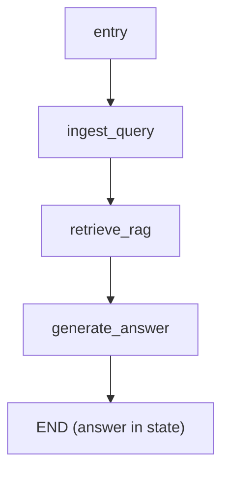
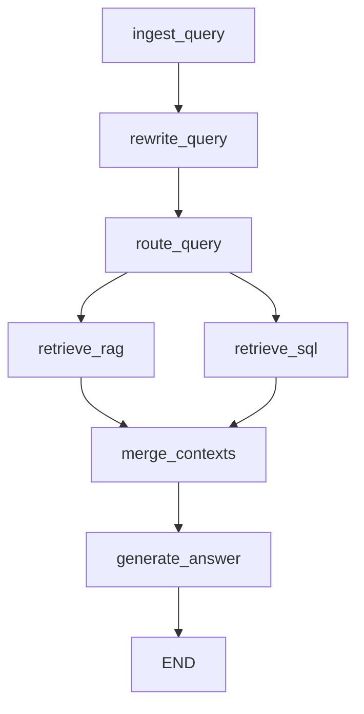

# LangGraph Migration Plan

## 1. Preserve current behavior and prepare for future complexity

- **Review current RAG flow** in `[src/etb_project/main.py](src/etb_project/main.py)` and `[src/etb_project/retrieval](src/etb_project/retrieval)`:
  - PDF is loaded via `load_pdf()` and indexed into a FAISS vector store via `process_documents()`.
  - For each user query, `RetrieveDocumentsMiddleware` runs `vectorstore.similarity_search(query)`, builds an augmented message with context, and passes it to the LLM via `create_agent`.
- **Identify invariants to preserve**:
  - Same PDF source and config (`pdf`, `retriever_k`, `log_level`) from `[src/etb_project/config.py](src/etb_project/config.py)` and `[src/config/settings.yaml](src/config/settings.yaml)`.
  - Same embedding and LLM selection from `[src/etb_project/models.py](src/etb_project/models.py)`.
  - Same CLI UX: interactive loop prompting `Query:` and printing a single textual answer.
- **Define target extensibility goals**:
  - Easy addition of query rewriting, parallel retrieval (vector + SQL + others), reasoning steps, and response post-processing without rewriting the core graph.

## 2. Introduce LangGraph and core graph module

- **Add LangGraph as a dependency** in `requirements.txt` (e.g. `langgraph>=0.2`), keeping versions consistent with current LangChain ecosystem.
- **Create a dedicated graph module**:
  - Add `[src/etb_project/graph_rag.py](src/etb_project/graph_rag.py)` to hold:
    - The state schema.
    - Node implementations (functions).
    - A `build_rag_graph(deps) -> CompiledGraph` factory that wires dependencies and returns the compiled graph.
- **Keep retrieval utilities unchanged** in `[src/etb_project/retrieval/process.py](src/etb_project/retrieval/process.py)` and `[src/etb_project/retrieval/loader.py](src/etb_project/retrieval/loader.py)` so indexing behavior remains stable.

## 3. Design an extensible graph state

- **Define a single shared state type** (TypedDict or Pydantic) in `graph_rag.py` that anticipates future nodes:
  - `messages: list[BaseMessage]` – conversation history.
  - `query: str` – original user query.
  - `rewritten_query: str | None` – query after optional rewriting.
  - `context_docs: list[Document]` – unified retrieved documents for RAG.
  - `sql_result: dict | None` – structured result from SQL/tool nodes (future).
  - `reasoning_steps: list[str]` – high-level reasoning or intermediate decisions.
  - `tool_calls: list[dict]` – log of tools invoked (retrievers, SQL, etc.).
  - `route: str | None` – e.g. `"rag"`, `"sql"`, `"hybrid"` for routing decisions.
  - `answer: str | None` – final user-facing answer text.
- **Configure reducers** where appropriate:
  - `messages`: append reducer so nodes can add messages safely.
  - `reasoning_steps` and `tool_calls`: append reducers to accumulate steps.
  - Other scalar fields (`query`, `rewritten_query`, `route`, `answer`) can use simple overwrite semantics.

## 4. Implement core nodes for v1 behavior

### 4.1 `ingest_query` node

- **Responsibility**: Convert raw user text into initial state.
- **Behavior**:
  - Read raw input (passed from `main.py` when invoking the graph).
  - Create `messages = [HumanMessage(content=raw_query)]`.
  - Set `query = raw_query`.
  - Initialize other fields with sensible defaults (e.g. `rewritten_query=None`, `context_docs=[]`, etc.).

### 4.2 `retrieve_rag` node

- **Responsibility**: Perform vector RAG retrieval only.
- **Behavior**:
  - Use `rewritten_query` if present, else `query`.
  - Call the existing FAISS retriever built from `process_documents()` in `main.py`.
  - Store retrieved `Document` objects in `context_docs`.
  - Optionally record a `tool_calls` entry describing the retriever invocation.

### 4.3 `generate_answer` node

- **Responsibility**: Turn query + context into a final answer (v1).
- **Behavior**:
  - Build a prompt from `query` (or `rewritten_query`) and `context_docs` (e.g. concatenated text).
  - Use `get_ollama_llm()` (or `get_openai_llm()`) to call the LLM.
  - Append the resulting `AIMessage` to `messages`.
  - Set `answer` to the final user-facing text (can reuse `_get_agent_reply` logic or similar).

## 5. Build and compile the core graph

- **Construct a `StateGraph`** in `graph_rag.py`:
  - Register the state schema from step 3.
  - Add nodes: `"ingest_query"`, `"retrieve_rag"`, `"generate_answer"`.
- **Define edges and entry point for v1**:
  - Entry: `ingest_query`.
  - Edge: `ingest_query` → `retrieve_rag`.
  - Edge: `retrieve_rag` → `generate_answer`.
  - Edge: `generate_answer` → `END`.
- **Compile the graph** to produce an invokable object, e.g. `compiled_graph = graph.compile()` inside `build_rag_graph(deps)`.

## 6. Integrate graph into `main.py`

- **Reuse existing setup logic** in `[src/etb_project/main.py](src/etb_project/main.py)`:
  - Keep `load_config()`, logging configuration, and PDF existence checks unchanged.
  - Keep `load_pdf()` and `process_documents()` calls to build the FAISS vector store and retriever.
- **Replace agent creation with graph construction**:
  - Remove or bypass `create_agent(...)` and `RetrieveDocumentsMiddleware` usage.
  - Instantiate dependencies (LLM, retriever, any tool handles) and pass them into `build_rag_graph(...)` to get a compiled graph.
- **Update the interactive loop**:
  - For each `line` from `input("Query: ")`:
    - Build the minimal initial input for the graph (e.g. `{"query": line}` or similar entry payload expected by `ingest_query`).
    - Call `compiled_graph.invoke(initial_state_or_input)`.
    - Read `answer` from the resulting state and print it; if absent, fall back to the last `AIMessage` as today.
  - Preserve existing exit behavior on empty input or EOF.

## 7. Plan for future extension nodes (query rewriting, routing, parallel retrieval, SQL, reasoning, response shaping)

### 7.1 Query rewriting

- **Add a `rewrite_query` node** (future):
  - Input: `query`.
  - Output: `rewritten_query` and possibly log to `reasoning_steps`.
- **Graph change**:
  - Insert edge: `ingest_query` → `rewrite_query` → `retrieve_rag`.
  - `retrieve_rag` always uses `rewritten_query or query`.

### 7.2 Routing and parallel retrieval

- **Add a `route_query` node** (future):
  - Inspect `query`/`rewritten_query` to decide `route` (e.g. `"rag"`, `"sql"`, `"hybrid"`).
- **Add additional retrieval nodes**:
  - `retrieve_sql` – SQL DB / structured tool call using `query` or `rewritten_query`; writes `sql_result` and possibly `context_docs_sql`.
  - (Optionally) `retrieve_other` – other vector stores or APIs.
- **Add `merge_contexts` node**:
  - Merge `context_docs` from vector RAG and any other retrieval sources into the unified `context_docs` field.
- **Graph topology** (future):

### 7.3 Reasoning and response post-processing

- **Add a `reason` node** (future):
  - Input: `query`, `rewritten_query`, `context_docs`, `sql_result`.
  - Output: updates `reasoning_steps` with a structured reasoning summary.
- **Upgrade `generate_answer`**:
  - Leverage `reasoning_steps` and `sql_result` to craft a better answer.
- **Add a `postprocess_response` node** (future):
  - Enforce style, add citations, or do safety checks.
  - Finalize `answer` content for user display.

## 8. Maintain and extend tests

- **Review existing tests** in `[tests/test_main.py](tests/test_main.py)` and `[tests/test_retrieval_process.py](tests/test_retrieval_process.py)`:
  - Identify any tests that depend directly on `create_agent`, `RetrieveDocumentsMiddleware`, or specific function signatures.
- **Add graph-level tests for core nodes**:
  - Unit test `ingest_query`, `retrieve_rag`, and `generate_answer` individually with small, controlled inputs (e.g. in-memory docs and a stubbed LLM).
  - Integration test: small PDF or synthetic docs → build graph → invoke with a known query → assert that `answer` contains content from the expected document.
- **Later add tests for new nodes**:
  - `rewrite_query`, `route_query`, `retrieve_sql`, `merge_contexts`, `reason`, `postprocess_response` as they are introduced.

## 9. Documentation and architecture notes

- **Update `README.md`** to describe the LangGraph-based architecture:
  - Explain that the core RAG pipeline is implemented as a `StateGraph` with nodes `ingest_query`, `retrieve_rag`, and `generate_answer`.
  - Mention that the design anticipates additional nodes for rewriting, routing, parallel retrieval, SQL tools, reasoning, and response shaping.
- **Add a short design note** (e.g. `docs/langgraph.md`) that:
  - Documents the state schema fields and their purposes.
  - Shows the current v1 graph diagram and the planned extended graph.
  - Explains how to add or swap nodes without breaking existing behavior.

## 10. Execution order summary

- Implement v1 (sections 2–6) to match current behavior using the new extensible structure.
- Once stable, incrementally add and wire in new nodes from section 7 (query rewriting, routing, parallel retrieval, SQL, reasoning, post-processing), updating tests and docs alongside each change.
