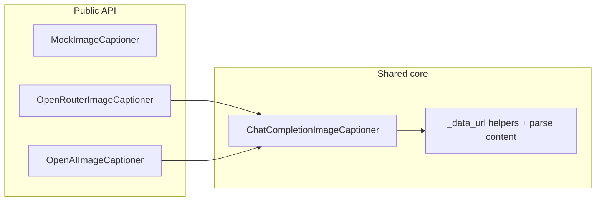

# OpenAI SDK image captioning refactor

## Context

- Today `[OpenRouterImageCaptioner](src/etb_project/document_processing/captioning.py)` uses raw `httpx` + manual JSON for `POST .../chat/completions` with `input_image` content parts.
- OpenRouter and direct OpenAI both support the **OpenAI-compatible** chat completions API; the `**openai`** Python SDK accepts `base_url` for OpenRouter (`[https://openrouter.ai/api/v1](https://openrouter.ai/api/v1)`) and default URL for OpenAI.
- `[langchain-openai](pyproject.toml)` already pulls `openai` transitively; add `**openai>=1.x**` explicitly to `[pyproject.toml](pyproject.toml)` dependencies (and mirror in `[requirements.txt](requirements.txt)` if it lists pins) so the captioning module has a direct, intentional dependency.

## Architecture

- `**ChatCompletionImageCaptioner**` (internal or public per preference): single implementation using `OpenAI(api_key=..., base_url=..., timeout=...)`, then `client.chat.completions.create(...)` with multimodal messages.
  - User message content: OpenAI-standard `**image_url**` with `data:...;base64,...` URL (works for OpenAI API and OpenRouter in typical setups). If integration tests show a specific OpenRouter model rejects `image_url`, add a small `**content_style**` flag or subclass hook only for that edge case—avoid duplicating the full HTTP path.
  - System prompt and user text: reuse the same strings as today (extract to module-level constants or one shared `_SYSTEM_PROMPT`).
  - Errors: catch SDK exceptions (`APIError`, `APIConnectionError`, etc.), log with similar detail as today (truncate body if available), return `None`.
- `**OpenRouterImageCaptioner**`: thin wrapper (subclass or composition) setting `base_url="https://openrouter.ai/api/v1"`, default key from `OPENROUTER_API_KEY`, default model from `[load_config().openrouter_image_caption_model](src/etb_project/config.py)`. Preserves existing import path for `[document_processor_cli.py](src/etb_project/document_processor_cli.py)` and README examples.
- `**OpenAIImageCaptioner**` (new): same core, `base_url=None` (OpenAI default), key from `OPENAI_API_KEY`, default model from a **new** config field `openai_image_caption_model: str | None = None` in `[AppConfig](src/etb_project/config.py)`, documented in `[src/config/settings.yaml](src/config/settings.yaml)`.

**CLI selection** (`[document_processor_cli.py](src/etb_project/document_processor_cli.py)`): instantiate captioner when exactly one backend is configured, or define clear precedence (recommended: **prefer `openrouter_image_caption_model` if set**, else `openai_image_caption_model`, so existing YAML keeps behavior; document that both should not be set intentionally).

## Files to touch

| Area    | Files                                                                                                                                                                                                                                                                                 |
| ------- | ------------------------------------------------------------------------------------------------------------------------------------------------------------------------------------------------------------------------------------------------------------------------------------- |
| Core    | `[src/etb_project/document_processing/captioning.py](src/etb_project/document_processing/captioning.py)`                                                                                                                                                                              |
| Config  | `[src/etb_project/config.py](src/etb_project/config.py)`, `[src/config/settings.yaml](src/config/settings.yaml)`                                                                                                                                                                      |
| Exports | `[src/etb_project/document_processing/__init__.py](src/etb_project/document_processing/__init__.py)` — export `OpenAIImageCaptioner`                                                                                                                                                  |
| CLI     | `[src/etb_project/document_processor_cli.py](src/etb_project/document_processor_cli.py)`                                                                                                                                                                                              |
| Tests   | `[tests/test_document_processing.py](tests/test_document_processing.py)` — replace `httpx.post` patches with mocks on `OpenAI` / `chat.completions.create`; add tests for OpenAI path and precedence; update `[tests/test_config.py](tests/test_config.py)` if new field is validated |
| Docs    | `[README.md](README.md)` image-captioning section; workspace rules: `[PROMPTS.md](PROMPTS.md)` log entry when implementing                                                                                                                                                            |

## Testing strategy

- Mock `**chat.completions.create`** returning an object with `choices[0].message.content` (minimal fake response), not raw HTTP.
- Keep `**MockImageCaptioner**` processor tests unchanged.
- Cover: model from config, missing key/model returns `None`, OpenRouter vs OpenAI constructor defaults if both classes exist.

## Out of scope (unless you expand later)

- Changing `[processor.py](src/etb_project/document_processing/processor.py)` metadata labels (`caption_source: "vlm"`) unless you want `"openai"` vs `"openrouter"`—optional follow-up.
