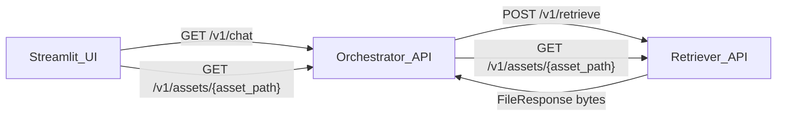

# Option B: Serve images via URL (Orchestrator proxy)

## Goal

Make image references in `sources[].metadata` renderable in Streamlit even when the Retriever runs in Docker and returns paths that don’t exist in the UI container.

You selected:

- Host assets on **Orchestrator** as a proxy (UI only talks to orchestrator).
- Require **the same auth behavior** as the Retriever API when configured.

## Key problems to fix

- **Filesystem paths aren’t portable** across containers/hosts.
- Retriever currently stringifies non-primitive metadata values, turning `image_captions` into a string:
  - `[src/etb_project/api/state.py](src/etb_project/api/state.py)` `_serialize_metadata`:

```21:30:src/etb_project/api/state.py
for key, val in meta.items():
    if isinstance(val, (str, int, float, bool)) or val is None:
        out[str(key)] = val
    else:
        out[str(key)] = str(val)
```

## Proposed API design

### Retriever: add a raw asset endpoint

Add to Retriever API (FastAPI) an endpoint to serve files from `document_output_dir` safely.

- **Route**: `GET /v1/assets/{asset_path:path}`
  - Example: `GET /v1/assets/images/page1_image1.png`
- **Root directory**: `RetrieverAPISettings.document_output_dir` (already in settings; default `data/document_output`)
- **Security**:
  - Prevent path traversal: resolve path and ensure it stays under `document_output_dir`.
  - Require `require_api_key_if_configured` (same as retrieve/index endpoints).
- **Response**:
  - Use FastAPI `FileResponse`.
  - Set `media_type` from extension (png/jpg/webp/etc). Fall back to `application/octet-stream`.
  - Consider `Cache-Control: public, max-age=...` (optional).

Why Retriever?

- Retriever is the component that owns and writes `document_output_dir` artifacts.

### Orchestrator: proxy endpoint (UI-friendly)

Add to Orchestrator API an endpoint that proxies the asset bytes from Retriever.

- **Route**: `GET /v1/assets/{asset_path:path}`
- **Behavior**:
  - Build the Retriever asset URL using orchestrator’s existing `retriever_base_url`.
  - Forward the caller’s `Authorization: Bearer ...` header if present.
  - Stream bytes back to the client with content-type preserved.

Why proxy?

- Streamlit UI only needs `ORCHESTRATOR_BASE_URL` (already true in `docker-compose.yml`).

## Metadata normalization (so UI has stable URLs)

Update metadata generation so images are referenced by **relative asset paths** rather than absolute OS paths.

Two places to address:

1. **Retriever metadata serialization**

- Update `_serialize_metadata` to preserve JSON-friendly nested types instead of stringifying everything.
  - Keep primitives.
  - For lists/dicts: recursively keep primitives; for `Path`, convert to string.
  - For unknown types: `str(val)`.

1. **Document processing metadata for images**

In `[src/etb_project/document_processing/processor.py](src/etb_project/document_processing/processor.py)` and/or where caption docs are created, store a stable relative reference:

- Add `asset_path` (or replace `path`) such as:
  - `images/page1_image1.png`
- Keep `path` optional for debugging, but UI should prefer `asset_path`.

Implementation approach:

- When images are extracted under `<output_dir>/images/...` and `<output_dir>` is `document_output_dir`, compute:
  - `asset_path = str(Path(info.path).relative_to(document_output_dir))`

## Streamlit UI changes

Update Streamlit source renderer (currently `app.py`) to render images via URL:

- For each image caption record:
  - If `asset_path` exists, render:
    - `st.image(f"{ORCHESTRATOR_BASE_URL}/v1/assets/{asset_path}")`
  - Else fall back to showing caption text only.
- Avoid checking `Path.exists()` for remote assets.

## Affected files (expected)

- Retriever API:
  - `[src/etb_project/api/app.py](src/etb_project/api/app.py)` (add `/v1/assets/...`)
  - `[src/etb_project/api/settings.py](src/etb_project/api/settings.py)` (no change expected)
  - `[src/etb_project/api/state.py](src/etb_project/api/state.py)` (fix `_serialize_metadata`)
- Orchestrator API:
  - `[src/etb_project/orchestrator/app.py](src/etb_project/orchestrator/app.py)` (add proxy `/v1/assets/...`)
- Document processing:
  - `[src/etb_project/document_processing/processor.py](src/etb_project/document_processing/processor.py)` (emit `asset_path` for extracted images/captions)
- Streamlit UI:
  - `[app.py](app.py)` (use orchestrator asset URL)

## Tests

Add unit tests to cover:

- `_serialize_metadata` preserving nested `image_captions` structures.
- Path traversal protection for Retriever `/v1/assets/...` (e.g., `../secret`).
- Orchestrator proxy returns bytes + content-type and forwards auth header.

## Manual verification

- Run docker compose.
- Retrieve a query that returns `image_captions`.
- Confirm `Sources -> Images` shows thumbnails.
- Confirm requesting `GET /v1/assets/images/...` via orchestrator works.

## Mermaid: high-level flow


