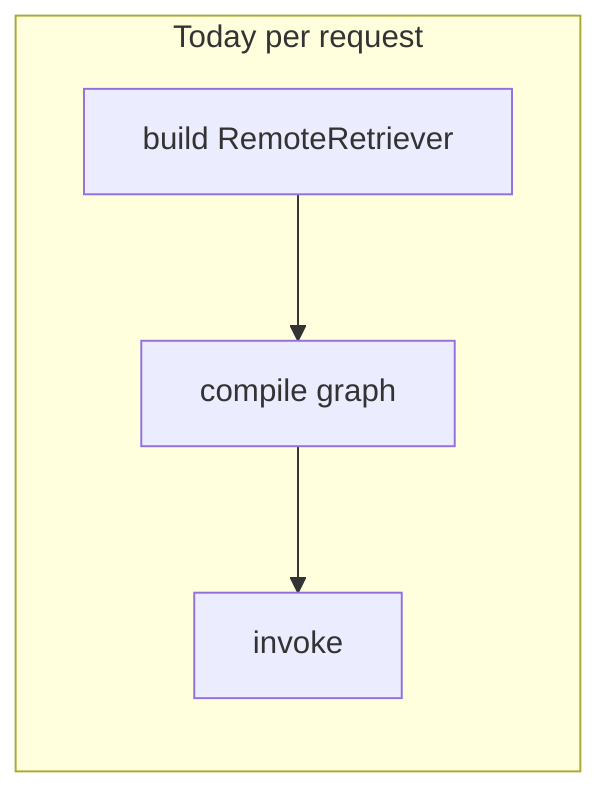
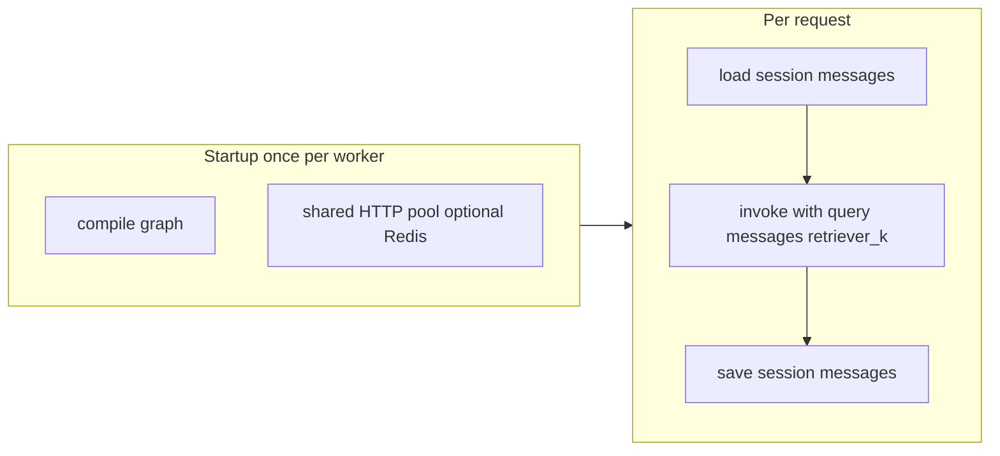

# Orchestrator: faster graph reuse, resilient HTTP, scalable sessions

## Current behavior (baseline)

- [`src/etb_project/orchestrator/app.py`](src/etb_project/orchestrator/app.py): every `POST /v1/chat` calls `_build_retriever`, `build_rag_graph`, then `graph.invoke`.
- [`src/etb_project/retrieval/remote_retriever.py`](src/etb_project/retrieval/remote_retriever.py): each `RemoteRetriever` constructs its own `httpx.Client`; `k` is fixed at construction time.
- [`src/etb_project/orchestrator/sessions.py`](src/etb_project/orchestrator/sessions.py): `InMemorySessionStore` — single-process only (already documented in docstring).
- [`src/etb_project/graph_rag.py`](src/etb_project/graph_rag.py): `retrieve_rag` closes over a single `retriever` with fixed `k`.

## Target behavior

---

## 1. Carry `k` in graph state and decouple retriever from fixed `k`

**Why:** A singleton compiled graph cannot close over a new `RemoteRetriever(base, k=k)` per request. Retrieval `k` must come from **runtime state**, not from a constructor closure.

**Changes:**

- Extend [`RAGState`](src/etb_project/graph_rag.py) with `retriever_k: int` (or `top_k`, name consistently with API).
- In `ingest_query`, **pass through** `retriever_k` from the incoming invoke state (explicitly include it in the returned dict so it is never ambiguous after partial merges).
- Update `retrieve_rag` to read `k = state.get("retriever_k")` (fallback: sensible default from settings or graph build-time default).
- Refactor [`RemoteRetriever`](src/etb_project/retrieval/remote_retriever.py) to support **`invoke(query: str, *, k: int | None = None)`** (or always require `k` from callers). The HTTP payload already sends `"k"`; wire this parameter through.

**Assumption:** LangGraph merges partial node outputs with prior state; explicit pass-through in `ingest_query` avoids relying on undocumented merge edge cases.

**Mitigation:** Add/adjust unit tests in [`tests/test_graph_rag.py`](tests/test_graph_rag.py) that invoke with `retriever_k` different from a default and assert the retriever mock receives the expected `k`.

---

## 2. Single compiled graph per orchestrator process

**Changes:**

- In [`create_app` lifespan](src/etb_project/orchestrator/app.py) (or a small `orchestrator/graph_factory.py`), after settings load: `get_chat_llm()`, build **one** `RemoteRetriever`-backed graph using a **long-lived** retriever instance (see section 3), `graph = build_rag_graph(...)`, store on a module-level or `app.state` reference (e.g. `_compiled_rag_graph`).
- Chat handler: `initial_state = {"query": body.message, "messages": prior, "retriever_k": k}` then `_compiled_rag_graph.invoke(initial_state)` — **no** `build_rag_graph` per request.

**Assumption:** Orion on/off is controlled only by `ETB_ORION_CLARIFY` env at process start (same as today for env-driven behavior). Changing it at runtime without restart would require a separate design.

**Mitigation:** Document in [`docs/CONFIGURATION.md`](docs/CONFIGURATION.md) / orchestrator README section that Orion is read at startup when using the singleton graph. If dynamic toggling is required later, add an admin reload endpoint or move Orion decision into a node that reads settings from a refreshable object.

**Tests:** Update [`tests/test_orchestrator_api.py`](tests/test_orchestrator_api.py) to patch `_compiled_rag_graph.invoke` or the module-level graph getter instead of `build_rag_graph` (or expose a thin `get_rag_graph()` for test injection).

**Out of scope:** Refactoring [`src/etb_project/main.py`](src/etb_project/main.py) / [`studio_entry.py`](src/etb_project/studio_entry.py) to use the same singleton — they can keep calling `build_rag_graph` for CLI/studio unless you want a shared factory; call that out as optional consistency work.

---

## 3. Shared HTTP client and resilience for retriever calls

**Problem today:** Creating a new `RemoteRetriever` per chat implies a new `httpx.Client` per request ([`remote_retriever.py`](src/etb_project/retrieval/remote_retriever.py) L33), which defeats connection pooling and can increase latency under load.

**Changes:**

- Introduce a **single** `httpx.Client` per process (or per `RemoteRetriever` singleton used by the graph), configured with `limits=httpx.Limits(max_connections=..., max_keepalive_connections=...)` via env (e.g. `ORCH_HTTP_MAX_CONNECTIONS`) with conservative defaults.
- Add **retries with exponential backoff** for idempotent failures: connection errors, HTTP 502/503, and optionally 429 with `Retry-After` if present. Use `tenacity` (add to [`pyproject.toml`](pyproject.toml) dependencies) or a small internal loop with caps (`ORCH_RETRIEVER_MAX_RETRIES`, `ORCH_RETRIEVER_RETRY_BACKOFF_MS`).
- Map failures to existing orchestrator semantics: still raise typed errors so [`OrchestratorAPIError`](src/etb_project/orchestrator/exceptions.py) or 502 responses remain consistent.

**Assumption:** `POST /v1/retrieve` is safe to retry for the same query (read-only retrieval).

**Mitigation:** Document that retries are only for transport/5xx; do not retry on 401/400. Cap total retry time below the existing timeout budget.

**Optional (small scope bump):** A lightweight **circuit breaker** (fail fast when retriever error rate exceeds threshold for N seconds). Implement with a tiny in-process counter or `pybreaker`. **Assumption:** single-process breaker is enough for one worker; multi-replica each has its own breaker (acceptable first step).

**Lifecycle:** Close the shared `httpx.Client` on app shutdown (`lifespan` yield teardown) to avoid leaked sockets in tests/reloads.

---

## 4. Pluggable session store: memory (default) vs Redis

**Goal:** Same API as [`InMemorySessionStore`](src/etb_project/orchestrator/sessions.py) (`get_messages` / `set_messages`) so [`app.py`](src/etb_project/orchestrator/app.py) stays simple.

**Changes:**

- Define a **`Protocol`** or abstract base class `SessionStore` in `orchestrator/sessions.py` (or `session_store.py`) with the existing methods.
- Keep `InMemorySessionStore` as default when `ORCH_SESSION_BACKEND=memory` or unset.
- Add `RedisSessionStore`:
  - Key pattern: e.g. `etb:orch:session:{session_id}` (configurable prefix env).
  - Value: JSON list of message dicts (same shape as today’s serialized messages).
  - **TTL:** refresh TTL on each `set_messages` using `ORCH_SESSION_TTL_SECONDS` (SET with EX or EXPIRE after write).
  - Use **`redis`** client with connection pool from URL `REDIS_URL` (new env).

**Assumption:** Redis is acceptable as the first shared store (common for session/cache). No strong consistency requirement beyond “last write wins.”

**Mitigation:**

- If `ORCH_SESSION_BACKEND=redis` but `REDIS_URL` is missing or Redis is down at startup: **fail fast** with a clear log and `OrchestratorAPIError`/process exit during lifespan, OR fall back to memory with a **loud** warning — pick one policy explicitly in code and document it (recommended: **fail fast in production** when redis is selected; memory fallback only for `ORCH_SESSION_REDIS_FALLBACK=1` dev flag to avoid silent split-brain across replicas).

**Docker:** Add an **optional** `redis` service to [`docker-compose.yml`](docker-compose.yml) and pass `REDIS_URL=redis://redis:6379/0` to orchestrator when using Redis-backed sessions. Document that single-container local dev can stay on memory.

**Tests:** Unit tests with `fakeredis` or a mock Redis client to avoid requiring a live server in CI.

---

## 5. Asset proxy HTTP client (secondary)

[`asset_proxy`](src/etb_project/orchestrator/app.py) creates `httpx.AsyncClient` per request. **Optional same-phase improvement:** one `AsyncClient` on app lifespan for asset proxy only, with same timeout and connection limits.

**Assumption:** Low traffic for assets vs chat; lower priority than retriever pooling.

---

## 6. Configuration, docs, and observability

- Extend [`OrchestratorSettings`](src/etb_project/orchestrator/settings.py) with new fields (backend, redis url, retry counts, http limits, breaker thresholds if implemented). Load from env with safe defaults matching current behavior.
- Update [`docs/CONFIGURATION.md`](docs/CONFIGURATION.md), [`docs/ARCHITECTURE.md`](docs/ARCHITECTURE.md), and [`README.md`](README.md) (per workspace rule) with: session backend selection, Redis requirement for multi-replica, retry behavior, and “Orion env requires restart.”
- Log **structured fields** on chat path: `session_id` (hashed or truncated if PII-sensitive), `retriever_k`, `session_backend`, duration — without logging full message bodies in production.

---

## 7. Testing and quality gates

- Extend [`tests/test_orchestrator_api.py`](tests/test_orchestrator_api.py) for singleton graph injection pattern.
- New tests: `RedisSessionStore` serialization round-trip; retry behavior on mocked 503 from httpx.
- Run existing `pytest` + mypy/ruff as in CI.

---

## Explicit assumptions and mitigations (summary)

| Topic | Assumption | Mitigation |
|--------|------------|------------|
| Retrieval idempotency | Retrying `POST /v1/retrieve` is safe | Retry only transport/5xx; no retry on 4xx; bounded attempts |
| Orion toggle | Env read at startup is OK | Document; optional future dynamic config |
| Redis availability | Infra provides Redis when `backend=redis` | Fail fast or explicit dev-only fallback flag |
| Session consistency | Last-write-wins is acceptable | Document; no cross-region Redis in v1 |
| Circuit breaker | Per-process is acceptable | Document; global rate limits need API gateway later |
| Async migration | Sync `invoke` remains OK | Defer `ainvoke` + async LLM to a later phase |

---

## Suggested implementation order

1. State + `RemoteRetriever.invoke(..., k=...)` + graph node changes + tests (enables singleton graph without behavior change).
2. Lifespan singleton graph + shared retriever client + teardown + orchestrator test updates.
3. Retries (and optional breaker) around retriever HTTP.
4. `SessionStore` protocol + `RedisSessionStore` + settings + docker-compose optional Redis + tests.
5. Documentation sweep (README, CONFIGURATION, ARCHITECTURE).

---

## Deferred (not in this “step better” scope)

- **Full async** (`async def` chat + `ainvoke`) — larger change across LLM stack.
- **LangGraph checkpointing in Postgres** — only needed if you require durable mid-graph resume beyond message lists.
- **Idempotency-Key** for duplicate POSTs from the UI — add if clients retry unsafe networks.
