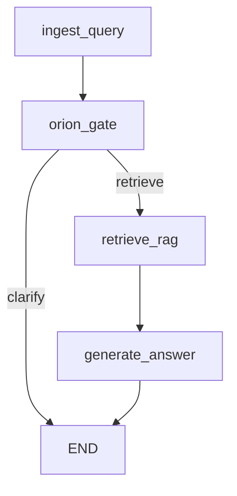

# Orion pre-retrieval clarification (conditional LangGraph)

## Goal

Run the **Orion** system prompt **before** `retrieve_rag`: if the user query is not specific enough, return a clarifying reply **without** calling the retriever; if the model signals **READY TO RETRIEVE**, set `**rewritten_query`** and continue **retrieve_rag → generate_answer**.

---

## Step 1 — Intent and ownership (aligns with prior “Step 1”)

- **Server-only behavior**: Streamlit (`[app.py](app.py)`) stays a thin HTTP client; **no** client-side Orion logic.
- **Single source of truth**: Move the Orion text from `[app.py](app.py)` (lines 18–72) into a dedicated module, e.g. `[src/etb_project/orchestrator/prompts.py](src/etb_project/orchestrator/prompts.py)` (or `etb_project/prompts/orion.py`), exported as e.g. `ORION_SYSTEM_PROMPT`.
- **Root `app.py`**: Remove the duplicated string or `from etb_project... import ORION_SYSTEM_PROMPT` **only if** you still need it for display/docs; otherwise delete unused constant to avoid drift.

---

## Step 2 — Prompt text and parsing contract

- Keep the existing **READY TO RETRIEVE:** marker contract from the current prompt (one sentence after the marker).
- Add a small **pure function** module (e.g. `parse_orion_response` in `[src/etb_project/graph_rag.py](src/etb_project/graph_rag.py)` or `etb_project/orchestrator/orion_parse.py`):
  - Detect marker (case-insensitive, strip whitespace).
  - Extract **refined query** (line after marker or remainder of paragraph).
  - Return a small result type: `(ready: bool, refined_query: str | None, display_text: str)` where `display_text` is the full model text for clarify path, or for ready path optionally stripped of marker for logging.
- **Future hardening** (optional follow-up): structured output / JSON schema from the LLM; not required for MVP if parsing is tested.

---

## Step 3 — Extend `RAGState` (`[src/etb_project/graph_rag.py](src/etb_project/graph_rag.py)`)

- Reuse `**route: str | None`** with normalized values, e.g. `"clarify"` | `"retrieve"` (document in `RAGState` docstring).
- Ensure `**rewritten_query`** is set in `**orion_gate**` when `route == "retrieve"` (from parsed refined query); fallback to raw `query` if parsing fails but model said ready (log or treat as not ready—pick one policy and test it).

---

## Step 4 — New node: `orion_gate`

- **Inputs**: State after `**ingest_query`** (must include `messages` with the latest `HumanMessage` for the current turn, plus session history from `prior`).
- **LLM call**:
  - Build: `[SystemMessage(ORION_SYSTEM_PROMPT)] + list(state["messages"])` (standard chat order).
  - `response = llm.invoke(...)`.
  - Extract text via existing `[_extract_text_from_ai_message](src/etb_project/graph_rag.py)`.
- **Branching**:
  - **If clarify**: append `**AIMessage`** with clarification text; set `**answer`** to that text; set `**route**` = `"clarify"`; leave `**rewritten_query**` unset or unchanged; **do not** call retriever (downstream skipped by graph).
  - **If ready**: append `**AIMessage`** with full Orion reply (includes READY line) **for session continuity**; set `**rewritten_query`** from parser; set `**route`** = `"retrieve"`; **leave `answer` unset** so `**generate_answer`** is the sole writer of the user-visible final answer on this path (avoids double “answer” semantics).
- **Edge case**: Orion prompt allows **assumption after 2 rounds** — rely on conversation in `**messages`**; no extra counter in state unless you add `**clarification_rounds`** later.

---

## Step 5 — Conditional edges

- Replace linear edges from `[ingest_query](src/etb_project/graph_rag.py)` with:
  - `ingest_query → orion_gate`
  - `add_conditional_edges("orion_gate", router, {"clarify": END, "retrieve": "retrieve_rag"})`
  - `retrieve_rag → generate_answer → END`
- `**router**`: read `state.get("route")` and map to `"clarify"` / `"retrieve"`; default safe behavior if missing: `"clarify"` or raise in dev—**must be covered by tests**.

---

## Step 6 — `ingest_query` and `retrieve_rag` (minimal changes)

- `**ingest_query`**: Keep current behavior (append user `HumanMessage`, seed state). No change unless you need to reset `**route`** between turns—clear `**route**` at start of `ingest_query` if stale state could leak (unlikely if each `invoke` passes fresh `query` + `messages` from session).
- `**retrieve_rag**`: Already uses `rewritten_query` or `query` (`[graph_rag.py](src/etb_project/graph_rag.py)` lines 99–100); ensure **only the retrieve path** runs this node.

---

## Step 7 — `generate_answer` (only on retrieve path)

- **Query text**: Continue using `rewritten_query` or `query` (already aligned).
- **Message history**: Today `**generate_answer`** appends a synthetic `**HumanMessage`** containing “Question / Context” to **full** `messages` (including Orion turns). That is acceptable for MVP; if quality suffers, a follow-up is to invoke the LLM with **truncated** history: e.g. `[SystemMessage(grounding)] + [HumanMessage(RAG bundle)]` only, while still **persisting** full LangGraph `messages` for the session. Document this as an optional refinement.
- **Grounding instructions**: Keep existing context vs no-context strings; they apply to **document-grounded** answers after retrieval, distinct from Orion’s role.

---

## Step 8 — Orchestrator HTTP layer (`[src/etb_project/orchestrator/app.py](src/etb_project/orchestrator/app.py)`)

- `**/v1/chat`**: Keep `graph.invoke({"query": body.message, "messages": prior})`.
- **Empty answer**: Still reject empty `**answer`** after invoke; valid for **clarify** path (`answer` set in `orion_gate`) and **retrieve** path (`answer` set in `generate_answer`).
- **Sources**: Unchanged—**clarify** path has `**context_docs`** empty → **sources: []** when `return_sources` is true.
- **Optional (Step 10)**: extend `**ChatResponse`** with e.g. `phase: "clarify" | "answer"` derived from `result.get("route")` or a dedicated flag set in graph—only if the UI needs to branch.

---

## Step 9 — Session persistence and serialization (missing gap)

- `[InMemorySessionStore](src/etb_project/orchestrator/sessions.py)` types `**messages`** as `list[dict]`, but LangGraph may return `**BaseMessage**` instances. **Verify** after `orion_gate`/`generate_answer` that persisted values are JSON-serializable or convert using LangChain **message dumps** (`messages_to_dict` / `map_chat_messages_to_dict` depending on your `langchain-core` version) before `set_messages`, and **load** with the inverse when calling `get_messages`. Add this **only if** runtime errors appear or as a proactive fix in the same PR.
- Ensure **multi-turn** clarification works across HTTP calls: **prior** must round-trip correctly.

---

## Step 10 — Optional API / product fields (`[src/etb_project/orchestrator/schemas.py](src/etb_project/orchestrator/schemas.py)`)

- Optional: `phase`, `refined_query` in response for debugging/UI.
- If unchanged, **Streamlit** can continue to show `**answer`** only; clarify turns simply show text with **no sources** (already true).

---

## Additional steps for completeness

| Item                   | Action                                                                                                                                                                                                                                                                                                                                                         |
| ---------------------- | -------------------------------------------------------------------------------------------------------------------------------------------------------------------------------------------------------------------------------------------------------------------------------------------------------------------------------------------------------------- |
| **Feature flag**       | Add `enable_orion_gate: bool = True` to `build_rag_graph(...)` **or** env `ETB_ORION_CLARIFY=1`. When **False**, wire `ingest_query → retrieve_rag` (skip `orion_gate`) for `[main.py](src/etb_project/main.py)` interactive loop and `[studio_entry.py](src/etb_project/studio_entry.py)` if they should behave like “direct RAG” without multi-turn session. |
| **CLI `main.py`**      | Today invokes `rag_graph.invoke({"query": line})` **without** `messages`—each turn is stateless. Either document that **Orion multi-turn requires** passing `**messages` from previous `result`** in the loop, or default `**enable_orion_gate=False`** for CLI.                                                                                               |
| **Unit tests**         | Extend `[tests/test_graph_rag.py](tests/test_graph_rag.py)`: clarify path (retriever **not** invoked), ready path (retriever invoked with **refined** query). Mock LLM with **two** `invoke` behaviors for ready path (Orion + RAG). Add tests for `**parse_orion_response`**.                                                                                 |
| **Orchestrator tests** | Update `[tests/test_orchestrator_api.py](tests/test_orchestrator_api.py)` mocks so fake graph returns `**route`** / `**messages`** as needed; add one test for clarify response with **empty sources**.                                                                                                                                                        |
| **Docs**               | Update `[docs/ARCHITECTURE.md](docs/ARCHITECTURE.md)` (orchestrator flow) and `[README.md](README.md)` per workspace rules.                                                                                                                                                                                                                                    |
| **PROMPTS.md**         | Log the implementation task prompt per `[.cursor/rules/log-prompts.mdc](.cursor/rules/log-prompts.mdc)`.                                                                                                                                                                                                                                                       |
| **Unit-testing rule**  | Read `[.cursor/rules/unit-testing-requirements.mdc](.cursor/rules/unit-testing-requirements.mdc)` when implementing and add coverage for new functions and branches.                                                                                                                                                                                           |

---

## Risk checklist

- **Marker reliability**: Mitigate with tests; consider structured output later.
- **Latency**: Ready path = **2 LLM calls** (Orion + RAG answer); acceptable for MVP.
- **Token growth**: Long sessions inflate `messages`; optional pruning later.

---

## Files likely touched (summary)

- New: `[src/etb_project/orchestrator/prompts.py](src/etb_project/orchestrator/prompts.py)` (or equivalent)
- Edit: `[src/etb_project/graph_rag.py](src/etb_project/graph_rag.py)` (graph + nodes + parser)
- Edit: `[src/etb_project/orchestrator/app.py](src/etb_project/orchestrator/app.py)` (optional response fields)
- Edit: `[src/etb_project/orchestrator/schemas.py](src/etb_project/orchestrator/schemas.py)` (optional)
- Edit: `[app.py](app.py)` (remove or re-import prompt)
- Edit: `[src/etb_project/main.py](src/etb_project/main.py)` / `[src/etb_project/studio_entry.py](src/etb_project/studio_entry.py)` (flag or session messages)
- Edit: `[tests/test_graph_rag.py](tests/test_graph_rag.py)`, `[tests/test_orchestrator_api.py](tests/test_orchestrator_api.py)`
- Edit: `[docs/ARCHITECTURE.md](docs/ARCHITECTURE.md)`, `[README.md](README.md)`, `[PROMPTS.md](PROMPTS.md)`
