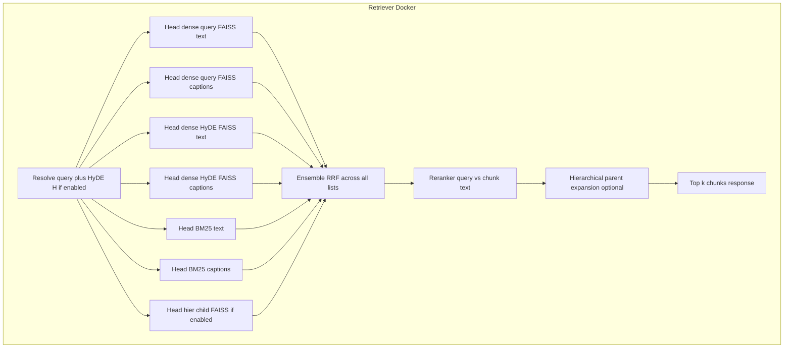

# Retrieval technique plan documents (four files)

After you approve this meta-plan, the follow-up implementation step is to **add four new files** under `docs/plans/`:

| File                                                                               | Role                                                                            |
| ---------------------------------------------------------------------------------- | ------------------------------------------------------------------------------- |
| [docs/plans/retrieval-keyword-bm25.md](docs/plans/retrieval-keyword-bm25.md)       | BM25 sparse heads (text + caption lists) feeding the global ensemble            |
| [docs/plans/retrieval-hyde.md](docs/plans/retrieval-hyde.md)                       | HyDE dense heads (query vector vs hypothetical vector) feeding the ensemble     |
| [docs/plans/retrieval-hierarchical.md](docs/plans/retrieval-hierarchical.md)       | Child-level FAISS + SQLite parents; expansion **after** ensemble + rerank       |
| [docs/plans/retrieval-ensemble-rerank.md](docs/plans/retrieval-ensemble-rerank.md) | **Unified ensemble + reranker** (final step before response); pipeline contract |

Each technique doc defines **what ranked lists it contributes**. The **ensemble + rerank** doc is the single source of truth for the **final** ordering and `k` truncation returned in `POST /v1/retrieve`.

---

## Deployment boundary

- **Retriever Docker** only: candidate generation (all heads), **ensemble**, **rerank**, hierarchical expansion, serialization to `ChunkOut`.
- **Orchestrator:** `RemoteRetriever` → `POST /v1/retrieve` with optional JSON flags; **no** ensemble/rerank code.

**Note:** Heads that are disabled (e.g. HyDE `off`, hybrid `dense`-only without BM25, no hierarchy index) simply **do not contribute lists**; RRF sums over the remaining lists only.

---

## Shared context

- Existing code: `[RetrieverServiceState](src/etb_project/api/state.py)`, `[DualRetriever](src/etb_project/retrieval/dual_retriever.py)`, `[RetrieveRequest](src/etb_project/api/schemas.py)`, indexing in `[indexing_service.py](src/etb_project/vectorstore/indexing_service.py)`.

---

## Global retrieve pipeline (repeat verbatim in all four `docs/plans/*.md`)

1. **Resolve query:** Read `query` from request; apply HyDE LLM when enabled to obtain `H` (hypothetical passage) as needed for heads.
2. **Candidate generation (parallel where practical):** Each enabled **head** runs with an oversample `**k_fetch`** (env e.g. `ETB_RETRIEVAL_K_FETCH`, default `max(k * 5, 30)` cap ~100). Each head returns an **ordered** list of `Document` (same metadata keys as today). Tag internally with `head_id` for logging/tracing (optional metadata key `ensemble_head`, stripped before response if undesirable).
  - **Dense–query:** `embed_query(query)` → similarity search on text FAISS + caption FAISS → **two** lists (or one merged list; ensemble doc picks **two lists** for symmetry with BM25).
  - **Dense–HyDE:** If `hyde_mode` is `replace`, only HyDE dense lists participate for the HyDE slots (query dense lists may be omitted or down-weighted per ensemble doc). If `fuse`, both query- and `H`-embedded searches run → up to **four** dense lists (text+caption × query+HyDE) or dedupe to two FAISS stores × two vectors — specify exactly in ensemble doc (recommend: **four lists** when fuse for maximum signal).
  - **BM25:** If hybrid/strategy includes sparse: `bm25_text`, `bm25_caption` lists.
  - **Hierarchical child:** If hierarchy index present: child FAISS search (same embedding as dense–query or HyDE per policy — default **query embedding** for child head to avoid doubling HyDE cost; document override if HyDE+child should use `H`).
3. **Ensemble:** Apply **Reciprocal Rank Fusion** across all lists that returned at least one doc. Stable dedupe key: `[DualRetriever._doc_key](src/etb_project/retrieval/dual_retriever.py)` `(page_content, source, page, path)` or, if hierarchy uses synthetic child ids, include `child_id` in key — hierarchical plan must align key with ensemble doc. RRF constant `ETB_RRF_K` (default 60). Output: ordered candidate pool `C` of size `k_ensemble` (e.g. min(`|C_raw|`, `ETB_ENSEMBLE_CAP` default 80)).
4. **Rerank (final ordering):** Score each candidate in `C` with the active **reranker** using the **user query string** (refined query from client, not `H` unless documented). Sort descending; take top `**k_return`** = request `k` (clamped by server max).
5. **Hierarchical expansion (post-rerank):** If `expand=true` and hierarchy exists: map each of the top `k_return` **child** hits to `parent_id`, fetch parent `full_text` from SQLite, **collapse** to unique parents while **preserving rerank order** (first occurrence wins), apply `ETB_PARENT_CONTEXT_CHARS` / `ETB_MAX_PARENTS` caps. Returned `page_content` is parent body (or concatenation policy from hierarchical plan). If `expand=false`, return reranked **child** chunks unchanged.

**Failure isolation:** If reranker fails → fall back to ensemble order truncated to `k`. If ensemble receives zero lists → 503 or empty chunks per existing API behavior.

---

## Document 1: `docs/plans/retrieval-keyword-bm25.md` (revised role)

- **Purpose:** Persisted sparse corpus + BM25; expose `**search_text(query, k_fetch)`** and `**search_captions(query, k_fetch)**` as **ensemble heads only** — not the final merge.
- Remove any wording that RRF here is the **terminal** user-facing ordering; RRF lives in **ensemble doc**.
- Keep JSONL layout, manifest `sparse_*`, indexing rebuild on append, `rank-bm25` dependency, tokenization.
- `**ETB_RETRIEVE_STRATEGY`:** `dense` skips BM25 heads entirely; `hybrid` registers BM25 lists in ensemble.

---

## Document 2: `docs/plans/retrieval-hyde.md` (revised role)

- HyDE produces **extra dense ranked lists** (from `embed_query(H)` on text + caption stores). `**fuse`** = query dense lists + HyDE dense lists all passed to ensemble (four lists when using separate text/caption searches per vector).
- `**replace`:** HyDE-only dense lists for those stores (ensemble may still get BM25 + hier child from `query` string for lexical/child).
- **Clarify:** Lexical BM25 always uses the **original request `query`** (not `H`), unless a future flag says otherwise — document default as **query**.

---

## Document 3: `docs/plans/retrieval-hierarchical.md` (revised role)

- **Child FAISS** participates in ensemble as `**hier_child`** lists (same `k_fetch`).
- **Parent SQLite** is used **only in step 5** after rerank, not during RRF (avoids comparing incompatible parent vs child lengths in reranker).
- Chunk identity: ensure `child_id` or stable hash in metadata for dedupe with dense children from the same index.

---

## Document 4: `docs/plans/retrieval-ensemble-rerank.md` (new — required)

**Purpose:** Implement `etb_project/retrieval/pipeline.py` (name TBD) invoked from `[RetrieverServiceState.retrieve](src/etb_project/api/state.py)`: `run_retrieval(request, state) -> list[Document]`.

**Ensemble:**

- Input: `list[tuple[head_id, list[Document]]]`.
- Algorithm: RRF as in global pipeline; document tie-breaking (e.g. preserve first-seen ensemble order).

**Reranker backends** (env `ETB_RERANKER`):

| Value                  | Behavior                                                                                                                                                                        |
| ---------------------- | ------------------------------------------------------------------------------------------------------------------------------------------------------------------------------- |
| `off`                  | Skip reranking; use ensemble order only (truncate to `k`).                                                                                                                      |
| `cosine` (default MVP) | Re-score with `dot(embed_query(query), embed_document(chunk))` or cosine using **existing Ollama embeddings**; no new models.                                                   |
| `cross_encoder`        | Optional: `sentence-transformers` CrossEncoder (e.g. ms-marco MiniLM); document model name, lazy load, CPU/GPU note, dependency optional extra in pyproject.                    |
| `llm`                  | Pointwise: chat LLM scores 0–10 or classifies relevance for each candidate in `C` (batched prompt with N chunks max per call); higher latency; reuse retriever chat LLM client. |

**Config:** `ETB_RERANKER`, `ETB_ENSEMBLE_CAP`, `ETB_RRF_K`, `ETB_RETRIEVAL_K_FETCH`, reranker-specific timeouts and batch sizes.

**API:** Optional `reranker: Literal["off","cosine","cross_encoder","llm"] | None` on `[RetrieveRequest](src/etb_project/api/schemas.py)` (None → env). Optional response debug field `scores` behind `ETB_RETRIEVAL_DEBUG=1` (default off).

**Tests:** unit tests for RRF with 3+ synthetic lists; reranker ordering inversion fixture; integration test pipeline end-to-end with mocks for FAISS/BM25/LLM.

**Performance:** Document expected latency (ensemble is cheap; `llm` rerank is expensive); recommend `cosine` or `cross_encoder` for production.

---

## Orchestrator / `RemoteRetriever`

- Forward optional `strategy`, `hyde_mode`, `expand`, `reranker` in JSON body once implemented.

---

## Repo hygiene (when executing after approval)

- Log prompts to `[PROMPTS.md](PROMPTS.md)`.
- Update `[README.md](README.md)` when behavior/env vars ship.

---

## Suggested execution order

1. **Ensemble + rerank pipeline skeleton** in retriever with **dense-only** heads (current behavior) so ordering is regression-testable.
2. **Keyword** (BM25 heads wired into ensemble).
3. **HyDE** (extra dense heads).
4. **Hierarchical** (child head + post-rerank expansion).

Alternatively build heads first then integrate ensemble — either way, **ensemble + rerank is the final integration step** before calling the release “complete.”
