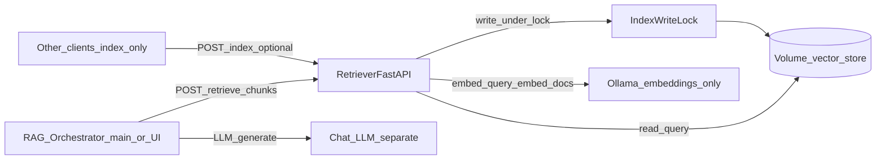
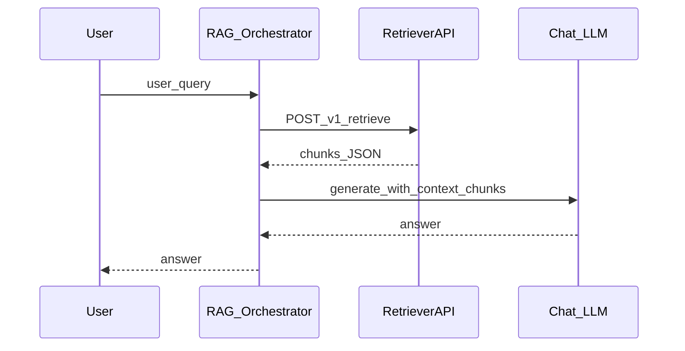

# Plan 1: Standalone retriever API + Docker

## RAG graph stays outside the retriever (explicit boundary)

- **Retriever service responsibility**: Persisted **dual FAISS** load, `**DualRetriever.invoke`** for a query, **indexing** (append/rebuild). Exposes **chunks + metadata** over HTTP only.
- **Not in this service**: `[build_rag_graph](src/etb_project/graph_rag.py)`, LangGraph, chat LLM calls, answer synthesis. Those run in a **RAG orchestrator** (e.g. `[src/etb_project/main.py](src/etb_project/main.py)` interactive loop, a future small “agent” service, or the chat UI backend) which:
  1. Calls `POST /retrieve` on the retriever with the user query (and optional `k`).
  2. Feeds returned chunks into the graph/LLM locally (same pattern as today’s in-process flow, but step 1 is HTTP).

This keeps the retriever image **smaller and simpler**: it needs **Ollama (or configured embeddings) for embedding** during index and query; it does **not** need the chat LLM unless you later duplicate concerns (avoid).

## Current baseline (what you are migrating away from)

- **Runtime RAG today**: `[src/etb_project/main.py](src/etb_project/main.py)` loads persisted dual FAISS, builds `DualRetriever`, runs `build_rag_graph` **in the same process**. **No HTTP server**; interactive mode uses `input()`.
- **After migration**: **Retriever process** = HTTP + vectors + embeddings only. **RAG process** = existing graph + LLM, wired to call retriever HTTP for context.
- **Indexing**: `[append_to_and_persist_index_for_pdfs](src/etb_project/vectorstore/indexing_service.py)` / CLI `[document_processor_cli.py](src/etb_project/document_processor_cli.py)` — unchanged semantics; API delegates to the same functions.
- **Docker mismatch**: `[Dockerfile](Dockerfile)` `EXPOSE 8000` + `[docker-compose.yml](docker-compose.yml)` port map, but `CMD` runs `python -m etb_project.main` (stdin loop, not HTTP).

## Target architecture

- **Single retriever service** (v1): FastAPI owns **retrieve** + **index** only. No `/rag` endpoint.
- **Optional later split**: indexer worker; v1 can use **FastAPI BackgroundTasks** + lock + in-memory job ids.

## API contract (versioning, schema, limits)

- **URL versioning**: Prefix routes with `/v1/` (e.g. `GET /v1/health`, `POST /v1/retrieve`, `POST /v1/index/documents`) so breaking changes can add `/v2/` without silent client breaks. Document **deprecation policy** (headers or changelog) in `docs/RETRIEVER_API.md`.
- **Stable response shape for `POST /v1/retrieve`**: Document a **Pydantic response model** and OpenAPI examples, e.g. each chunk includes at minimum:
  - `content: string`
  - `metadata: object` (pass-through from LangChain `Document.metadata`: e.g. `source`, `page` if present)
  - Optional: `id` or stable hash for deduplication client-side
  - Optional: `score` if the stack exposes similarity scores in a later iteration (v1 can omit if not available from `DualRetriever` output)
- **Limits**: Enforce **max `k`** (align with config upper bound, e.g. same as `retriever_k` max in `[AppConfig](src/etb_project/config.py)`), **max JSON body size** for `/retrieve`, and **max multipart size / per-file limit** for `/index` to reduce DoS risk.
- **Idempotency (indexing)**: Optional HTTP header `Idempotency-Key` for `POST /index` — if the same key repeats with the same payload semantics, return **same job id / 200** (v1 can document “best effort” or defer to v2; if deferred, state “not supported in v1” explicitly).

## Implementation outline

1. **New module** (e.g. `src/etb_project/api/`): FastAPI app, Pydantic models, singleton state: paths, **cached `DualRetriever`**, reload after successful index.
2. **Endpoints**
  - `GET /v1/health` — process up; optionally split `**/v1/ready`** vs liveness: **liveness** = process running; **readiness** = `backend.is_ready` + embeddings ping (Kubernetes-friendly).
  - `POST /v1/retrieve` — body `{ "query": str, "k": int? }` — JSON list of chunk objects per contract above.
  - `POST /v1/index/documents` — multipart; `reset` query param; optional `202` + `GET /v1/jobs/{id}`.
3. **Write lock**: concurrent index → `409`/`423` `INDEX_BUSY`.
4. **Dependencies**: `fastapi`, `uvicorn[standard]`, `python-multipart`.
5. **Entrypoint**: `uvicorn etb_project.api.app:app --host 0.0.0.0 --port 8000`.
6. **Docker**: named volumes; Ollama for **embeddings**; **resource limits** (memory/CPU) on indexing-heavy container in compose/K8s docs.

## Graceful shutdown

- On **SIGTERM**, stop accepting **new** index jobs if using a queue; wait for in-flight **single-threaded** index under lock to finish or timeout (configurable), then exit. Document behavior if shutdown mid-index (volume may need rebuild — link to runbook).

## Failure cases and responses

| Scenario                           | Detection                             | API behavior                                                       |
| ---------------------------------- | ------------------------------------- | ------------------------------------------------------------------ |
| Index missing / corrupt            | `not backend.is_ready` or load raises | `GET /health` degraded; `POST /retrieve` → `503` `INDEX_NOT_READY` |
| Chunk/embedding mismatch on append | `ValueError` from indexing_service    | `409` + `reset=true` or align chunking                             |
| Concurrent index writes            | lock held                             | `409`/`423` `INDEX_BUSY`                                           |
| Embeddings backend down / timeout  | Ollama embed fails                    | `502`/`503`; health `embeddings_ok: false`                         |
| Empty retrieval                    | retriever returns `[]`                | `200` with `chunks: []`                                            |
| Upload invalid / too large         | validation                            | `413`/`415`                                                        |
| Disk / permission on persist       | `OSError`                             | `507`/`500` (no stack leak to client)                              |
| Partial persist crash              | torn dir                              | runbook; optional atomic persist follow-up                         |
| Malicious upload                   | file handling                         | random filenames, uploads dir not served as static files           |
| Rate limit exceeded                | middleware                            | `429` with `Retry-After` optional                                  |

**Out of retriever scope**: LLM failures belong to the **RAG orchestrator**.

## Security

- **Authentication**: Prefer **network isolation** (private VPC) + optional `**Authorization: Bearer <RETRIEVER_API_KEY>`** middleware for v1; alternatively document **reverse proxy** (nginx, API gateway) terminating TLS and auth. **Separate** read vs write scopes if needed later (`/index` admin-only).
- **Rate limiting**: Per-IP or global limits on `/retrieve` and `/index` (middleware or proxy); tune to prevent abuse of embedding backend.
- **CORS**: Only enable if a **browser** calls the retriever directly (unusual); default **deny** or restrict origins.
- **Secrets**: Embedding URL, **captioning API keys** (`[OpenRouterImageCaptioner](src/etb_project/document_processing/captioning.py)` / OpenAI) via env or secret store; document **rotation** and never commit `.env`.

## Observability

- **Structured logging**: JSON or key=value fields including `request_id` (from header `X-Request-ID` or generated), route, status, duration ms.
- **Metrics** (minimal v1): retrieve latency, index job duration, error counts by code; expose `**/metrics`** only if adopting Prometheus (optional todo).
- **Tracing**: Optional OpenTelemetry hook later; v1: **correlation id** passed through logs.

## Operations and data lifecycle

- **Backups**: Document periodic backup of **named volume** holding `vector_store_path` and manifest; restore procedure (stop service, restore volume, start).
- **Index compatibility**: Changing **embedding model id** or chunk settings requires **rebuild** (existing manifest checks); document migration steps when bumping `[DEFAULT_EMBEDDING_MODEL_ID](src/etb_project/vectorstore/indexing_service.py)`.
- **Per-document delete/replace**: **Out of scope for v1** (append-only FAISS today). Document as limitation; future: metadata-filtered delete or full rebuild from source PDF list.

## Multi-tenant (optional / later)

- **v1**: Single corpus per deployment (one `vector_store_path`). **Later**: multiple indexes via subpaths or separate volumes + `X-Tenant-ID` routing — not required for initial ship.

## Testing strategy

- **Unit**: `httpx`/`TestClient` for all routes, error JSON shape, limits, lock contention (mock or temp dir).
- **Integration**: Optional CI job or manual `**docker compose up`** test: health → index small PDF → retrieve returns non-empty (requires Ollama or mocked embeddings in test profile).
- **Contract**: Snapshot or schema test for `**POST /v1/retrieve`** response JSON so orchestrator clients do not break silently.
- **Coverage**: Align new modules with project expectations (see `[docs/DEVELOPMENT.md](docs/DEVELOPMENT.md)` / pytest coverage settings).

## CI/CD

- Extend `[.github/workflows/ci.yml](.github/workflows/ci.yml)`: install deps, run pytest including new `tests/test_api_*.py`; optional **Docker build** step to catch broken Dockerfile (no push required).

---

# Plan 2: Updating backends that use the retriever (clients + RAG layer)

## Split: retriever client vs RAG orchestrator

| Component                                                                                 | Role                                                                       |
| ----------------------------------------------------------------------------------------- | -------------------------------------------------------------------------- |
| **Retriever HTTP API**                                                                    | Chunks + index management                                                  |
| **RAG orchestrator** (e.g. refactored `[main.py](src/etb_project/main.py)`, or UI server) | `build_rag_graph`, LLM, user session; calls retriever for **context only** |

## LangGraph and multiple retriever invocations (decision)

- **Issue**: In-process `DualRetriever` may be invoked **more than once** per user turn if the graph/tool loop calls the retriever repeatedly. A naive `**RemoteRetriever`** would issue **multiple HTTP calls** per turn (latency + load).
- **Plan decision (pick one during implementation)**:
  - **A (simplest)**: One HTTP call per `invoke()` — preserves current graph behavior; accept **N HTTP round-trips** per complex turn.
  - **B**: **Cache** in the adapter: key = `(query string)` + TTL for the duration of the graph run (risk: stale if index updates mid-turn — low for short TTL).
  - **C**: **Refactor graph** so retrieval runs **once** per user message and passes fixed docs into the LLM step (larger change to `[graph_rag.py](src/etb_project/graph_rag.py)`).

Document the chosen letter in `docs/RETRIEVER_API.md` and in orchestrator code comments.

## Consumers to update

| Consumer                                                                 | Today                                          | After migration                                                                              |
| ------------------------------------------------------------------------ | ---------------------------------------------- | -------------------------------------------------------------------------------------------- |
| `[main.py](src/etb_project/main.py)`                                     | In-process `DualRetriever` + `build_rag_graph` | `RemoteRetriever` (or HTTP → docs adapter) + existing graph when `ETB_RETRIEVER_MODE=remote` |
| `[document_processor_cli.py](src/etb_project/document_processor_cli.py)` | Direct indexing                                | Keep for batch; or automation via `POST /v1/index`                                           |
| Chat UI                                                                  | External LLM only                              | Clarify query → `POST /v1/retrieve` → LLM in **UI backend**                                  |

## Client implementation pattern

1. **Env**: `RETRIEVER_BASE_URL`, `RETRIEVER_TIMEOUT_S`, optional `RETRIEVER_API_KEY`.
2. `**RemoteRetriever`**: `invoke(query) → docs` via `httpx` to `POST /v1/retrieve`; map JSON to LangChain `Document` for `[build_rag_graph](src/etb_project/graph_rag.py)`.
3. **Errors**: Map retriever `503/502` to “search unavailable”; LLM errors stay local to orchestrator.
4. **Security**: Retriever internal-only where possible.

## Deployment topology

- **Compose default**: `**retriever`** service (this API) + `**ollama`** (embeddings) + volumes.
- **Optional second service**: `**rag-app`** running `main.py` or Streamlit with `ETB_RETRIEVER_URL=http://retriever:8000` — same repo, two containers on one network.
- **README**: Document env wiring and **no LLM inside retriever container**.

## Migration sequencing

1. Ship retriever API + Docker + tests.
2. Add orchestrator **remote** mode + `RemoteRetriever`.
3. Keep **local** mode for dev.
4. Document two-container model.

## Diagram (RAG outside retriever)

---

## Repo and workspace deliverables

- `**[README.md](README.md)**`: How to run retriever Docker, env vars, and how to run RAG orchestrator against it.
- `**[docs/ARCHITECTURE.md](docs/ARCHITECTURE.md)**`: Diagram and boundary: retriever vs RAG vs embeddings.
- `**[docs/RETRIEVER_API.md](docs/RETRIEVER_API.md)**`: Full API, limits, error codes, versioning.
- `**[PROMPTS.md](PROMPTS.md)**` (root): Per workspace rule, log agent prompts when implementation work is done via agent sessions (time-stamped entries).

---

## Files likely touched (implementation phase)

- New: `src/etb_project/api/` — **no import of `build_rag_graph`**.
- New or update: `RemoteRetriever` under `src/etb_project/retrieval/` or adjacent; orchestrator refactor in `[main.py](src/etb_project/main.py)`.
- Update: `[pyproject.toml](pyproject.toml)`, `[requirements.txt](requirements.txt)`, `[Dockerfile](Dockerfile)`, `[docker-compose.yml](docker-compose.yml)`, `[.github/workflows/ci.yml](.github/workflows/ci.yml)`.
- Tests: `tests/test_api_retriever.py` (naming as preferred), optional `tests/integration/test_retriever_compose.py` behind marker if slow.

Core `[graph_rag.py](src/etb_project/graph_rag.py)` remains an **orchestrator** dependency, not the retriever service’s.
