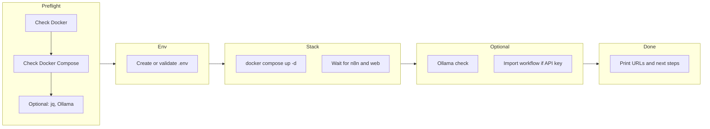

# Start-everything script for Job Search (n8n + Ollama)

## Goal

One script that brings the stack up and guides the user to the point where they can open n8n and execute the **Job Search (Ollama)** workflow (manual run or schedule).

## Current flow (from [README.md](README.md))

1. Create `.env` with `N8N_RUNNERS_AUTH_TOKEN` (e.g. `openssl rand -hex 32`).
2. Run `docker compose up -d` (n8n on 5678, web UI on 8080, runners internal).
3. Optional: run Ollama on host (`ollama serve`, `ollama pull nemotron-3-nano`).
4. Optional: get n8n API key (Settings → API), put in `secrets/n8n-api.txt`, run `./import-workflow.sh`.
5. User opens [http://localhost:5678](http://localhost:5678) → opens workflow → clicks **Execute Workflow**.

## What the script will do (step by step)

### 1. Preflight

- **Required:** `docker` and `docker compose` (or `docker-compose`) in PATH; exit with clear message if missing.
- **Optional:** If `jq` is missing, print a note that workflow import will require it (`brew install jq` or similar). Do not block.
- **Optional:** If `ollama` is not in PATH or Ollama API (e.g. `http://localhost:11434`) is not reachable, print a note that the workflow’s LLM features need Ollama; do not block.

### 2. .env setup

- If `.env` does not exist:
  - Generate token: `openssl rand -hex 32`.
  - Write `.env` with a single line: `N8N_RUNNERS_AUTH_TOKEN=<token>`.
  - Print: “Created .env with N8N_RUNNERS_AUTH_TOKEN.”
- If `.env` exists: optionally check that `N8N_RUNNERS_AUTH_TOKEN` is set (non-empty); if not, print a warning and point to README.

### 3. Start stack

- Run `docker compose up -d` (from project root).
- Wait until n8n is reachable (e.g. `curl -s -o /dev/null -w "%{http_code}" http://localhost:5678` returns 200 or 302) with a short retry loop (e.g. every 2s, max 30s).
- Optionally wait for web UI (e.g. `http://localhost:8080`) the same way.
- On timeout, print “n8n (or web) did not become ready; check: docker compose logs n8n” and exit 1.

### 4. Optional: Ollama

- Try `curl -s -o /dev/null -w "%{http_code}" http://localhost:11434/api/tags` (or similar). If not 200, print:
  - “Ollama not detected. For cover letters and scoring, run: ollama serve && ollama pull nemotron-3-nano”
  - Remind that `data/config.json` uses `ollamaBaseUrl: http://host.docker.internal:11434` for Docker.

### 5. Optional: Import workflow

- If `secrets/n8n-api.txt` exists (and is non-empty):
  - When calling the import script, use the **container** config path so the workflow works inside Docker: set `CONFIG_PATH=/home/node/.n8n-files/config.json` (because [docker-compose.yml](docker-compose.yml) mounts `./data` at `/home/node/.n8n-files`).
  - Run `./import-workflow.sh` (script must respect `CONFIG_PATH` from environment; see below).
  - On success, print the workflow URL (e.g. `http://localhost:5678/workflow/<id>`).
- If `secrets/n8n-api.txt` does not exist:
  - Print instructions: open [http://localhost:5678](http://localhost:5678) → Settings → API → Create an API key → save to `secrets/n8n-api.txt`, then run this script again (or run `./import-workflow.sh`) to import the workflow.

### 6. Final instructions

Print something like:

- **n8n:** [http://localhost:5678](http://localhost:5678)
- **Job search web UI:** [http://localhost:8080](http://localhost:8080)
- **To run the workflow:** Open n8n → open the “Job Search (Ollama)” workflow → click **Execute Workflow**.
- If the workflow was just imported, include the direct link: [http://localhost:5678/workflow/.](http://localhost:5678/workflow/)

## Import script change (for Docker config path)

[import-workflow.sh](import-workflow.sh) currently forces the config path to the **host** path: `CONFIG_PATH="${SCRIPT_DIR}/data/config.json"`. When n8n runs in Docker, the workflow must use `/home/node/.n8n-files/config.json`.

- In `import-workflow.sh`: use `CONFIG_PATH` from the environment when set, otherwise keep current default:
  - `CONFIG_PATH="${CONFIG_PATH:-${SCRIPT_DIR}/data/config.json}"`
- The start script will then call:
  - `CONFIG_PATH=/home/node/.n8n-files/config.json ./import-workflow.sh`
  so the imported workflow works without manual path change in the UI.

## File to add

- `**start.sh`** (or `start.sh` in a `scripts/` folder; recommend project root so it sits next to `import-workflow.sh` and `docker-compose.yml`):
  - Executable (`chmod +x`).
  - Use `#!/usr/bin/env bash` and `set -e`; source script directory for paths.
  - Implement the steps above in order; keep output concise and actionable.

## Optional choices (clarify if needed)

- **Workflow file:** The script will use the existing [import-workflow.sh](import-workflow.sh), which imports [n8n-job-search-workflow.json](n8n-job-search-workflow.json). If you prefer to import [Job Search (Ollama) (2).json](Job%20Search%20(Ollama)%20(2).json) instead, the import script (or a new one) would need to point at that file; the start script can then call whichever import you standardize on.
- **Interactivity:** Prefer a non-interactive script (no prompts); optional steps (Ollama, import) are best-effort with clear printed instructions when skipped.

## Summary

| Step | Action                                                                                                     |
| ---- | ---------------------------------------------------------------------------------------------------------- |
| 1    | Preflight: Docker, Docker Compose; optional jq/Ollama check                                                |
| 2    | Create or validate `.env` (N8N_RUNNERS_AUTH_TOKEN)                                                         |
| 3    | `docker compose up -d`; wait for n8n (and optionally web)                                                  |
| 4    | Optional: check Ollama; print instructions if not running                                                  |
| 5    | Optional: if `secrets/n8n-api.txt` exists, run import with `CONFIG_PATH=/home/node/.n8n-files/config.json` |
| 6    | Print n8n and web URLs and “how to run the workflow”                                                       |

One small change to `import-workflow.sh` (honor `CONFIG_PATH` env) ensures the imported workflow works in Docker without editing the Config path node.
