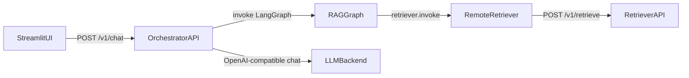

## Goal

- Introduce **Option A** architecture: **Streamlit UI → Orchestrator API → Retriever API**.
- Keep retrieval remote by using existing `RemoteRetriever` (`POST /v1/retrieve`).
- Use an **OpenAI-compatible chat completions** backend for answer generation, configurable via environment variables.

## Current state (what we’ll reuse)

- **Retriever service** endpoints live in `[src/etb_project/api/app.py](src/etb_project/api/app.py)`: `POST /v1/retrieve`, `POST /v1/index/documents`, health/ready.
- **Remote retriever client** is `[src/etb_project/retrieval/remote_retriever.py](src/etb_project/retrieval/remote_retriever.py)` with `invoke(query)->list[Document]`.
- **RAG orchestration graph** is `[src/etb_project/graph_rag.py](src/etb_project/graph_rag.py)`: `build_rag_graph(llm, retriever)` which calls `retriever.invoke(query)` and returns `answer` and `context_docs`.
- **Streamlit UI** is root `[app.py](app.py)`, currently calling a chat-completions endpoint directly.

## Target architecture

## API design (Orchestrator)

- **Endpoint**: `POST /v1/chat`
- **Request body** (Pydantic):
  - `session_id: str` (required)
  - `message: str` (required)
  - Optional future-proof fields: `k: int | None`, `return_sources: bool = true`, `metadata: dict[str, Any] | None`
- **Response body**:
  - `answer: str`
  - `sources: list[{content: str, metadata: dict}]` (derived from `context_docs`)
  - Optional `request_id` (pass-through/header) for tracing

## Session/memory strategy

- **Phase 1 (minimal)**: per-request RAG invocation using `graph.invoke({"query": message})`.
  - This matches your current `graph_rag.generate_answer()` behavior, and is enough to prove end-to-end integration.
- **Phase 2 (multi-turn)**: store and pass `messages` across turns (server-side) keyed by `session_id`.
  - Start with an in-memory dict for dev.
  - Add a clear extension point to swap to Redis later.

## LLM backend integration (OpenAI-compatible)

- Add a small adapter in orchestrator service that produces a LangChain `BaseChatModel` compatible object (or reuses existing `etb_project.models` if it already supports OpenAI-compatible settings).
- Configuration via env vars (examples):
  - `ORCH_OPENAI_BASE_URL`
  - `ORCH_OPENAI_API_KEY`
  - `ORCH_OPENAI_MODEL`
  - `ORCH_OPENAI_TEMPERATURE` (optional)

## Remote retriever integration

- Orchestrator reads:
  - `RETRIEVER_BASE_URL` (required)
  - `RETRIEVER_API_KEY` (optional; `RemoteRetriever` already supports bearer token via env)
  - `ORCH_RETRIEVER_K` (optional default, otherwise use config)

## Implementation outline (files)

- **New**: `src/etb_project/orchestrator/`
  - `app.py`: FastAPI app with `/v1/chat`, health, readiness, CORS (if needed)
  - `schemas.py`: request/response models
  - `sessions.py`: in-memory session store interface (Phase 2)
  - `llm.py`: OpenAI-compatible LLM factory
  - `__main__.py`: `python -m etb_project.orchestrator` runner (uvicorn)
- **Modify**: `[app.py](app.py)` (Streamlit)
  - Replace `call_indmex_agent()` with `call_orchestrator_chat()` that POSTs to orchestrator `/v1/chat`.
  - Keep existing UI rendering; optionally show `sources` in an expander.
- **Docs**:
  - Update `[README.md](README.md)` to include how to run: retriever API, orchestrator API, then Streamlit.
  - If you rely on docker-compose, update `docker-compose.yml` accordingly (since you selected “either”, plan includes both run modes).

## Testing requirements

- Add unit tests for orchestrator endpoint behavior (including error cases):
  - missing `RETRIEVER_BASE_URL` → startup/ready fails or endpoint returns structured error
  - retriever 401/503 mapped to meaningful orchestrator errors
  - successful path returns `answer` and `sources`
- Use `pytest` with `TestClient` and mock:
  - `RemoteRetriever.invoke()` (avoid network)
  - LLM invocation (avoid external calls)

## Error handling + observability

- Add request IDs and structured logs (similar to Retriever API’s `RequestLoggingMiddleware` in `[src/etb_project/api/app.py](src/etb_project/api/app.py)`).
- Normalize errors to a JSON shape similar to retriever’s `ErrorBody` for consistency.

## Deployment/run instructions (both modes)

- **Python/dev**:
  - Start retriever: `python -m etb_project.api`
  - Start orchestrator: `python -m etb_project.orchestrator` (new)
  - Start UI: `streamlit run app.py`
- **Docker compose**:
  - Add orchestrator service, set env vars for retriever URL, LLM base URL/key/model.
  - Optionally expose ports 8000 (retriever), 8001 (orchestrator), 8501 (streamlit).

## Non-code project rules to follow

- Log this request to `PROMPTS.md` (workspace rule).
- Ensure `README.md` stays accurate with run instructions (workspace rule).
