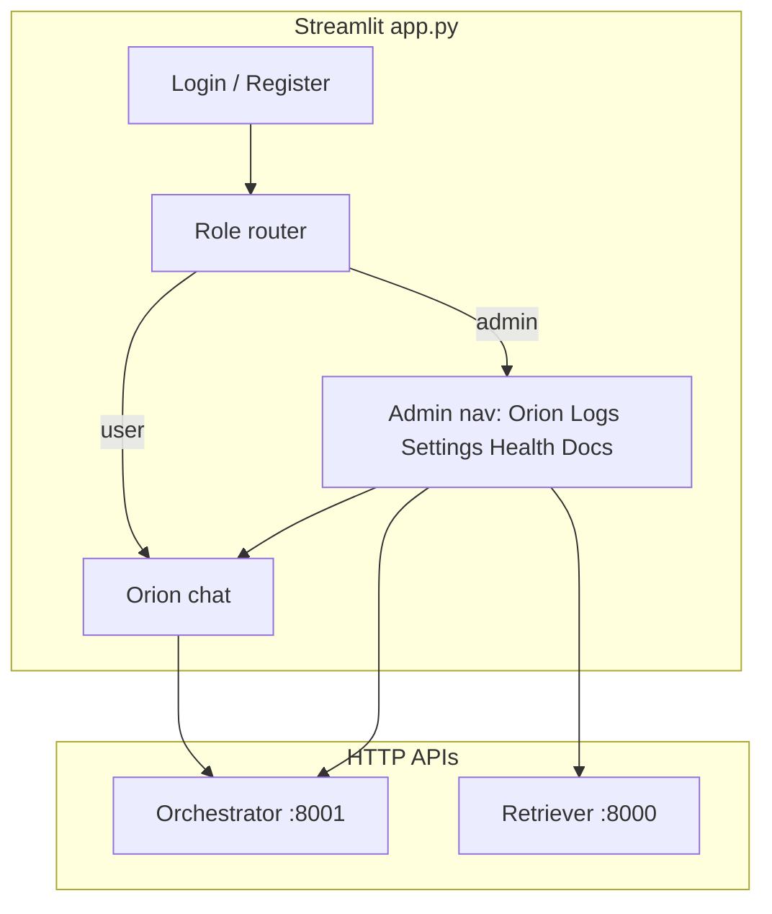

# Streamlit access control (general users + admin)

## Goals

- **General user**: Register (username + password), log in, land on **Orion** only (current chat UX). No admin navigation.
- **Admin**: Fixed credentials from **environment / `st.secrets`** only (no change-password or credential UI). After login, **switch** between **Orion**, **Logs**, **Settings**, **System health**, **Documents** (CRUD-oriented).
- **Security stance**: Streamlit gates what the browser shows; **all** sensitive backend operations use **server-side** validation (bearer tokens, constant-time comparisons, fail-closed routes). Follow **[Security measures](#security-measures-mandatory)** below—this is **in scope**, not optional polish.
- **Verification**: Implementation is not complete until **[Verification](#verification)** (automated + manual + smoke + definition of done) is satisfied.

## Architecture (high level)

## Consolidated decisions (incorporated)

These resolve earlier “TBD” / optional wording so implementation and **verification** are unambiguous.

| Topic                            | Decision                                                                                                                                                                                                                                                                                                                                                                                                                   |
| -------------------------------- | -------------------------------------------------------------------------------------------------------------------------------------------------------------------------------------------------------------------------------------------------------------------------------------------------------------------------------------------------------------------------------------------------------------------------- |
| **Admin API token name**         | Use `**ETB_ADMIN_API_TOKEN`** everywhere (orchestrator `/v1/admin/*`, retriever `/v1/admin/*`). Same secret value in Streamlit + both services when admin HTTP features are enabled.                                                                                                                                                                                                                                       |
| **Orchestrator chat token name** | `**ETB_ORCHESTRATOR_API_KEY`**: when non-empty, `POST /v1/chat` requires `Authorization: Bearer …`. Streamlit sends it from secrets/env.                                                                                                                                                                                                                                                                                   |
| **Retriever indexing auth**      | Unchanged: `**RETRIEVER_API_KEY`** when set; Streamlit document upload uses this header for `POST /v1/index/documents` (and jobs).                                                                                                                                                                                                                                                                                         |
| **Username case policy**         | **Case-sensitive** usernames in SQLite (`alice` ≠ `Alice`); document in README. Block registration of usernames that equal admin username under **exact** string match (after strip); normalize only **strip** whitespace, not case.                                                                                                                                                                                       |
| **Unified logs**                 | **In scope**: implement `**GET /v1/admin/recent-logs`** on **both** orchestrator and retriever with the **same response shape** (e.g. JSON list of `{ts, service, method, path, status, duration_ms}` with redaction applied). Admin **Logs** UI uses **two subtabs** (“Orchestrator”, “Retriever”) or a merged column `service`—either is fine if both endpoints exist and are verified.                                  |
| **Docker Compose**               | Document and wire in compose for the **Streamlit** service: `ETB_ADMIN_USERNAME`, `ETB_ADMIN_PASSWORD`, `ETB_ADMIN_API_TOKEN`, `ETB_ORCHESTRATOR_API_KEY`, `RETRIEVER_API_KEY` (if used), `ORCHESTRATOR_BASE_URL`, `RETRIEVER_BASE_URL`, user DB path on a **named volume** (e.g. mount `etb_data` or `streamlit_data` for `data/users.sqlite`). Orchestrator/retriever containers receive the same tokens where required. |
| **Fail-closed admin HTTP**       | If `ETB_ADMIN_API_TOKEN` is **set**, `/v1/admin/*` returns **401** without valid Bearer (stable JSON body). If **unset**, admin routes are **not registered** (no silent open admin API)—document that local dev may leave unset only when those features are unused.                                                                                                                                                      |

## 1. UI structure (avoid leaking admin URLs)

Streamlit’s default `[pages/](https://docs.streamlit.io/develop/concepts/multipage-apps)` sidebar lists every page to everyone. To keep **general users from seeing admin pages**, prefer a **single entrypoint** `[app.py](app.py)`:

- **Unauthenticated**: Show **Login** and **Register** (tabs or columns).
- **Authenticated user**: Render **only** the existing Orion block (refactor current `main()` body into e.g. `render_orion()` in the same file or `etb_project/ui/orion_chat.py`).
- **Authenticated admin**: Show a **sidebar `st.radio` or `st.segmented_control`** for `Orion | Logs | Settings | System health | Documents`, and `st.session_state` to remember the choice; each choice renders a small module under `etb_project/ui/admin/` (or similar).

**Session state** (extend `[ensure_session_state](app.py)`):

- `auth_role`: `None | "user" | "admin"`
- `auth_username`: `str | None`
- `admin_nav`: current admin section key
- Clear chat/messages as today; optionally clear on logout only.

**Login resolution order**: If username/password match **admin** (secrets/env), set `auth_role="admin"`. Else verify against the **user store**. This prevents registering the admin username as a normal user.

**UX detail**: Follow **[UI/UX requirements](#uiux-requirements)** below for auth layout, errors, admin nav, and destructive confirmations.

## 2. General user registration and storage

- **Persistence**: SQLite file under a repo-ignored path (e.g. `data/users.sqlite`), created on first use. Table: `users(username UNIQUE, password_hash, created_at)`.
- **Passwords**: Hash with **bcrypt** or **argon2** (add one dependency to `[requirements.txt](requirements.txt)`); verify with `secrets.compare_digest` only where comparing **hashes** if using constant-time helpers provided by the library.
- **Registration rules**: Enforce non-empty username/password, reasonable length, reject duplicate username; reject username equal to configured admin username (case policy: document as case-sensitive or normalize to lower once—pick one and apply consistently).
- **Tests**: Pure functions for “register”, “verify login”, “admin vs user resolution” in a small module (e.g. `etb_project/ui/auth_store.py`) with a temp SQLite path via pytest.

## 3. Admin credentials (fixed, not from UI)

- Configure via `**.streamlit/secrets.toml`** (local) and/or env vars (Docker), e.g. `ETB_ADMIN_USERNAME`, `ETB_ADMIN_PASSWORD`.
- Provide `**.streamlit/secrets.toml.example`** (no real secrets) documenting keys; add `data/*.sqlite` (or chosen path) to `.gitignore` if not already.
- **No** UI to change admin password (per your requirement).

## 4. Backend additions for admin-only features

Today:

- **Health**: `[GET /v1/health](src/etb_project/orchestrator/app.py)` and `/v1/ready` exist on **orchestrator** and **retriever** (`[src/etb_project/api/app.py](src/etb_project/api/app.py)`).
- **Document ingest**: `[POST /v1/index/documents](src/etb_project/api/app.py)` (multipart PDFs, optional `reset`, optional async job). **No** list/delete endpoints.

Recommended split:

| Admin UI section  | Data source                                                                                                                                                                                                                                                                                                                                                                                                                                                                                                                                                                                                                                                                                                                                                                                              |
| ----------------- | -------------------------------------------------------------------------------------------------------------------------------------------------------------------------------------------------------------------------------------------------------------------------------------------------------------------------------------------------------------------------------------------------------------------------------------------------------------------------------------------------------------------------------------------------------------------------------------------------------------------------------------------------------------------------------------------------------------------------------------------------------------------------------------------------------- |
| **System health** | `GET` health/ready on both services using `ORCHESTRATOR_BASE_URL` and `RETRIEVER_BASE_URL` (or existing env names from README).                                                                                                                                                                                                                                                                                                                                                                                                                                                                                                                                                                                                                                                                          |
| **Settings**      | Read-only display of **non-secret** env-driven config (URLs, ports, flags like chunk size env vars). **Mask** any key that looks like `*_API_KEY`, `*_TOKEN`, `*_PASSWORD`.                                                                                                                                                                                                                                                                                                                                                                                                                                                                                                                                                                                                                              |
| **Logs**          | Add ring buffer + `GET /v1/admin/recent-logs?limit=...` on **orchestrator and retriever** (same schema; redacted). **Only register** routes when `ETB_ADMIN_API_TOKEN` is set; require `Authorization: Bearer`. Streamlit admin Logs page calls both base URLs.                                                                                                                                                                                                                                                                                                                                                                                                                                                                                                                                          |
| **Documents**     | **C**: reuse `POST /v1/index/documents` with retriever `RETRIEVER_API_KEY` if configured. **R/D**: add retriever admin routes, same bearer dependency as logs (or reuse `RETRIEVER_API_KEY` if you want one token—prefer a dedicated admin token to separate “index” vs “read logs”, or document a single admin bearer). **List** staged PDFs under `[RetrieverAPISettings.upload_dir](src/etb_project/api/settings.py)`. **Delete** a staged file by id/filename with path traversal checks; after delete, **consistency** requires either a **full reindex from remaining files** in `upload_dir` (new internal helper + optional `POST /v1/admin/reindex-from-uploads` or query flag) or documenting “delete + manual reset reindex”—plan the **automated reindex-from-uploads** so CRUD is coherent. |

**Important**: UI login alone does **not** secure HTTP APIs. **In-scope mitigation**: require a **shared orchestrator API key** on `POST /v1/chat` when configured (see [Security measures](#security-measures-mandatory)), and **always** require retriever/admin keys for indexing and new admin routes. Document that **open** orchestrator/retriever URLs without these keys remain a deployment risk.

## 5. Orchestrator chat for general users

- After your change, **unauthenticated** users should not see Orion; only login/register.
- **In scope (security)**: When `ETB_ORCHESTRATOR_API_KEY` (or single agreed env name) is set, the orchestrator **rejects** `POST /v1/chat` without `Authorization: Bearer <token>`. Streamlit sends the token from secrets for **all** chat calls after login. If the key is **unset**, behavior matches today (dev convenience) with a **README warning** to set the key in any shared/production deployment.

## 6. Documentation and ops

- Update `[README.md](README.md)`: admin credentials (`ETB_ADMIN_USERNAME` / `ETB_ADMIN_PASSWORD`), user DB path, `**ETB_ADMIN_API_TOKEN`**, `**ETB_ORCHESTRATOR_API_KEY`**, `**RETRIEVER_API_KEY**`, compose volume for SQLite, and that admin is **not** creatable via registration.
- Add a **Verification** subsection in README (or link to this plan section) listing `pytest` targets and optional `curl` smoke commands—mirror [Verification](#verification).
- Update **Docker Compose** env/volumes per [Consolidated decisions](#consolidated-decisions-incorporated).
- Workspace rules: update `[PROMPTS.md](PROMPTS.md)` with implementation prompts when in agent mode.

## 7. File / module touch list (concise)

| Area                             | Files                                                                                                                                                                       |
| -------------------------------- | --------------------------------------------------------------------------------------------------------------------------------------------------------------------------- |
| Auth + routing                   | Refactor `[app.py](app.py)`; add `etb_project/ui/auth_`*, `etb_project/ui/admin/*.py`                                                                                       |
| User DB                          | `etb_project/ui/user_store.py` (SQLite + bcrypt)                                                                                                                            |
| Retriever admin                  | `[src/etb_project/api/app.py](src/etb_project/api/app.py)` + schemas for list/delete/reindex                                                                                |
| Orchestrator (chat + admin logs) | `[src/etb_project/orchestrator/app.py](src/etb_project/orchestrator/app.py)` — optional Bearer on `POST /v1/chat`; ring buffer + `/v1/admin/recent-logs` + `compare_digest` |
| Streamlit chat client            | `[app.py](app.py)` (or `etb_project/ui/orion_chat.py`) — send orchestrator Bearer when configured                                                                           |
| Config examples                  | `.streamlit/secrets.toml.example`, `.gitignore`                                                                                                                             |
| Tests                            | `tests/test_user_auth_store.py`, tests for new API routes (TestClient + bearer)                                                                                             |

## Risks / tradeoffs

- **Streamlit session** can be cleared or forged in the sense that this is not enterprise IAM; document deployment behind VPN/reverse proxy for production.
- **Document CRUD** today is really “staged PDFs + vector index”; true partial vector removal per file is heavier than “rebuild from remaining uploads”—the plan favors **rebuild-from-upload-dir** after delete for correctness.

## Security measures (mandatory)

These requirements exist to **prevent credential leaks**, **reduce auth bypass**, and **avoid misleading auth errors** (e.g. exposing internals or inconsistent 401/403 handling).

### Secrets and configuration

- **Never** commit real credentials; ensure `.streamlit/secrets.toml`, `.env`, and `data/users.sqlite` are **gitignored**; ship only `secrets.toml.example` with placeholder keys.
- **Generate** `ETB_ADMIN_API_TOKEN` (and orchestrator chat key) with a CSPRNG (e.g. `secrets.token_urlsafe(32)`); enforce a **minimum length** (e.g. 32 characters) at startup for production-oriented deployments or document warnings if shorter.
- **Do not** pass bearer tokens in **URL query strings** or log them; use `**Authorization: Bearer`** headers only.
- **Rotation**: Document that changing tokens requires updating Streamlit secrets/env **and** orchestrator/retriever env **together** to avoid false “auth errors” from mismatched configuration.

### Streamlit application layer

- **Defense in depth**: Before rendering any **admin-only** block, verify `st.session_state.get("auth_role") == "admin"`; never rely only on “hiding” widgets.
- **Logout**: Clear `auth_role`, `auth_username`, and any cached admin API responses that could contain sensitive snippets; do **not** leave half-authenticated state.
- **No sensitive echoes**: Never show passwords, raw tokens, or full `st.exception()` tracebacks to end users in production-facing flows—use **generic** error text and log details server-side only (without secrets).
- **Admin vs user resolution**: Check **admin** credentials **before** the user DB so behavior is deterministic and documented.

### User database and passwords

- **SQL**: Use **parameterized queries** / bound parameters only; never format SQL with user input.
- **Password storage**: **bcrypt** or **argon2** with a sensible work factor; verify with the library’s verify API (constant-time internally).
- **Input limits**: **Max length** on username and password (e.g. username ≤ 64, password ≤ 1024) to limit DoS on hashing and DB size; **charset** allowlist for usernames (e.g. alphanumeric + `_-.`) and reject control characters.
- **Timing**: Keep **failed login** path roughly similar in cost (always run password verify against a dummy hash when user missing—optional hardening) to reduce username enumeration via timing; at minimum use **generic** error copy (already in UI/UX).

### Backend bearer validation (orchestrator + retriever)

- **Constant-time comparison**: Validate bearer tokens with `hmac.compare_digest` or `secrets.compare_digest` against the configured secret (after normalizing to same encoding).
- **Fail closed for admin routes**: Align with [Consolidated decisions](#consolidated-decisions-incorporated): if `ETB_ADMIN_API_TOKEN` is **set**, valid Bearer required (**401** if missing/wrong); if **unset**, **do not register** `/v1/admin/`* routes.
- **Retriever indexing**: When `RETRIEVER_API_KEY` is set, **all** index/job/admin mutations must require it (existing pattern); Streamlit must send the same header the API expects.
- **Orchestrator chat**: When `ETB_ORCHESTRATOR_API_KEY` is **non-empty**, require Bearer on `POST /v1/chat`; return **401** with a **stable, non-leaky** JSON body (no stack traces). Streamlit sends the header after login. When **empty**, dev-open behavior remains; README warns production operators to set the key.

### Document and path safety (retriever admin)

- **Path traversal**: For list/delete, resolve candidate paths with `Path.resolve()` and ensure `**resolved.is_relative_to(upload_dir)`** (or equivalent) before any read/delete; reject `..`, absolute paths, and odd encodings.
- **Identifiers**: Prefer **opaque server-side ids** or strict basenames from a known list endpoint—not raw user-provided paths.
- **Uploads**: Keep PDF-only checks; optionally validate **magic bytes** (`%PDF`) in addition to extension to reduce confused deputy issues.

### Logs and admin “recent logs” feature

- **Redact** before storing in the ring buffer: strip or replace `Authorization` headers, cookies, and known password fields; truncate query strings that might contain tokens.
- **Never** log plaintext passwords or full bearer tokens in Python `logging` for request middleware.

### Abuse and availability

- **Rate limiting**: Extend or add limits for **login/register** attempts (per-session in Streamlit + document proxy/WAF for real IPs) and for **admin** HTTP endpoints (reuse or complement existing retriever rate limiter).
- **Payload limits**: Respect existing upload size limits; reject oversized JSON/query `limit` on log endpoints with a **cap** (e.g. max 500 lines).

### Transport and CORS

- **Production**: Terminate **TLS** at a reverse proxy; do not expose admin or chat APIs on plain HTTP across untrusted networks.
- **CORS**: Restrict `ORCH_CORS_ALLOW_ORIGINS` (and any retriever CORS) to the **actual Streamlit origin** in production, not `*`.

### Auth errors (consistent, safe UX)

- Map **401** → “Not authenticated” / configuration hint; **403** → “Forbidden”; **429** → rate limit; **connection errors** → connectivity—without embedding raw exception text or tokens.
- Automated tests for **wrong bearer**, **missing bearer**, and **malformed** `Authorization` header on new routes.

### Security-focused tests (pytest)

- Admin route without token → **401** when `ETB_ADMIN_API_TOKEN` is set; **404** / not registered when unset.
- Admin route with wrong token → **401**.
- Delete/list with traversal payloads → 400/404, no file escape.
- Optional: SQL injection strings as username on register → rejected or safe no-op.

## Gaps in the plan (explicit)

These are either **out of scope** today or **underspecified**—call them out so implementation does not silently omit them.

| Gap                                       | Why it matters                                                                                       | Resolution in scope                                                                                                                                                                                                                                           |
| ----------------------------------------- | ---------------------------------------------------------------------------------------------------- | ------------------------------------------------------------------------------------------------------------------------------------------------------------------------------------------------------------------------------------------------------------- |
| **API auth for Orion chat**               | Without a server-side key, clients can bypass Streamlit.                                             | **In scope**: `ETB_ORCHESTRATOR_API_KEY` + Bearer on chat when set; see [Security measures](#security-measures-mandatory).                                                                                                                                    |
| **Brute-force / abuse**                   | Login and register forms can be hammered; SQLite can be filled with junk users.                      | Covered under [Security measures — Abuse and availability](#security-measures-mandatory): Streamlit-side attempt caps + admin HTTP rate limits + README/WAF guidance.                                                                                         |
| **Session lifecycle**                     | No idle timeout or “remember me” policy defined.                                                     | Define **session behavior**: Streamlit default (browser session); optional **logout** clears `auth_`* and sensitive session keys; document that closing the tab ends the session unless cookies are added later (not planned).                                |
| **Password recovery**                     | No forgot-password flow for general users.                                                           | **Out of scope** unless added later (would need email or admin-assisted reset).                                                                                                                                                                               |
| **Unified logs**                          | Previously ambiguous.                                                                                | **Resolved**: both services implement `/v1/admin/recent-logs`; UI shows both (subtabs or `service` column). Verify per [Verification](#verification).                                                                                                         |
| **Docker / Compose wiring**               | Was underspecified.                                                                                  | **Resolved** in [Consolidated decisions](#consolidated-decisions-incorporated); verify with compose smoke in [Verification](#verification).                                                                                                                   |
| **Deep links and bookmarks**              | Streamlit reruns entire script; admin “section” is `session_state`—refresh may reset nav to default. | Persist **admin_nav** in `session_state` only (same as today) or accept default-on-refresh; document behavior.                                                                                                                                                |
| **Secrets missing at runtime**            | Admin opens Logs/Documents; API returns 401.                                                         | UX must detect missing `ETB_ADMIN_API_TOKEN` / misconfiguration and show **actionable** copy (see UI/UX below).                                                                                                                                               |
| **User DB backup / migration**            | No export, versioned schema, or migration hooks.                                                     | **MVP**: single schema, `CREATE IF NOT EXISTS`; document **backup** of `users.sqlite` for ops.                                                                                                                                                                |
| **Accessibility & i18n**                  | Not covered.                                                                                         | English-only MVP; follow basic **a11y** in UI section (labels, contrast, status text—not color alone).                                                                                                                                                        |
| **Orchestrator vs retriever admin token** | Operator confusion if undocumented.                                                                  | **Resolved**: single `**ETB_ADMIN_API_TOKEN`** for all `/v1/admin/`* on orchestrator and retriever; document in README and Settings (masked). Distinct from `**ETB_ORCHESTRATOR_API_KEY`** (chat only) and `**RETRIEVER_API_KEY`** (index/retrieve when set). |

## UI/UX requirements

### Global principles

- **Visual continuity**: Reuse the existing Orion **dark / glass** aesthetic from `[app.py](app.py)` (CSS variables, background gradients) on **login, register, and admin shell** so auth does not feel like a different product.
- **Clear roles**: After login, show a compact **header strip**: signed-in username and role (“User” / “Administrator”); avoid ambiguous wording.
- **Logout**: Always visible in a **consistent** place (sidebar top or header for both user and admin). On logout, clear `auth_role`, `auth_username`, and optionally offer “clear chat history” vs preserve (default: **preserve** unless product wants privacy-first clear).

### Authentication screens

- **Login vs Register**: Use `**st.tabs`** or equally prominent **two panels** with clear primary labels; default focus story: most users **Login** first.
- **Fields**: Username and password inputs with **visible labels** (not placeholder-only). Password fields use `type="password"`.
- **Register**: **Confirm password** field; **inline validation** on submit (match, min length e.g. 8+, max length cap); show errors **next to the action** via `st.error` / caption under the relevant section.
- **Feedback**: On successful registration, show **success message** and prompt to switch to Login (or auto-switch tab)—avoid silent failure.
- **Errors**: Use **generic** failed-login message (“Invalid username or password”) to reduce **user enumeration**; use **specific** safe messages for registration (e.g. “Username already taken”).
- **Loading**: Disable duplicate submits or show **spinner** on login/register while SQLite or hash work runs.

### General user (Orion-only)

- **No dead ends**: User never sees admin nav items; if they somehow lack backend connectivity, Orion already surfaces orchestrator errors—keep that pattern.
- **Optional**: Subtle **“Signed in as …”** in caption under title for reassurance.

### Admin shell (navigation)

- **Navigation**: Sidebar `**st.radio`** or `**st.segmented_control`** (Streamlit version permitting) with **fixed order**: Orion → Logs → Settings → System health → Documents. **Persist** `admin_nav` across reruns within the session; **default** first admin login to **Orion**; document refresh resets nav to default if `session_state` is lost.
- **Width**: Use `layout="wide"` for admin-only layout if **Documents** and **Logs** need horizontal space; keep Orion **centered** if that preserves the current chat UX (can switch `set_page_config` carefully—Streamlit allows one `set_page_config` per run: use a single call with the **widest** needed layout or accept one global layout).

### System health

- **Per service**: Show **Orchestrator** and **Retriever** in separate **cards** or expanders with `health` + `ready` results.
- **Status communication**: Use **text labels** (“Ready”, “Not ready”, “Unreachable”) in addition to any color; do not rely on **color alone** (color-blind friendly).
- **Errors**: Show **HTTP status**, **latency** (optional), and **truncated** error body for debugging without dumping secrets.

### Settings (read-only)

- **Grouping**: e.g. “URLs”, “Indexer / chunking”, “Security (masked)”.
- **Masking**: Display `*`** for secret-like keys; provide a **toggle** “Reveal lengths only” (e.g. `API key set (43 chars)`) instead of full values—never show raw tokens in UI.
- **Copy**: Short note that changes require **restart** / env update—not editable in UI.

### Logs

- **Monospace** block or `st.code` for **readability**; **line cap** with “Showing last N lines”.
- **Refresh**: Manual **Refresh** button to avoid hammering the API; optional auto-refresh with **interval** slider (advanced) or omit to keep MVP simple.
- **Empty / disabled**: If admin token unset or endpoint returns 403, show **configuration help** pointing to `secrets.toml` / env, not a raw stack trace.

### Documents (CRUD)

- **List**: Table or dataframe-style list with **filename**, **size**, **uploaded/stored id**, **actions** column.
- **Upload**: `st.file_uploader` with **PDF-only** hint; show **progress** / spinner while uploading and **job id** + link to poll if async.
- **Destructive actions**: **Delete** and **full reindex** require `**st.dialog`** or checkbox confirmation (“Type DELETE or check I understand”) before calling API.
- **Long jobs**: Poll **job status** with clear **states** (pending / running / completed / failed) and **error message** from API when failed.

### API / network failures

- **Consistent handling**: Wrapper for admin HTTP calls that maps **timeout**, **connection refused**, **401**, **403** to short, actionable messages and a **“Retry”** where appropriate.

### Testing UX (manual checklist)

- Full matrix: see **[Verification — Manual / E2E](#verification)**.
- First-time **no users**: register → login → Orion.
- **Duplicate register**, **wrong password**, **admin login** vs **user login**.
- Admin with **missing token**: Logs and Documents show helpful errors.
- **Logout** from admin mid-flow; **re-login** preserves expected state.

## Verification

Verification proves **auth correctness**, **no accidental open admin surface**, and **stable error behavior**. Run everything in CI where feasible (pytest); manual steps for Streamlit where not automated.

### Automated (pytest)

| Area                 | What to verify                                                                                                                                                                                                                  |
| -------------------- | ------------------------------------------------------------------------------------------------------------------------------------------------------------------------------------------------------------------------------- |
| **User store**       | Register duplicate → error; login wrong password → fail; login success → role `user`; admin username blocked from registration.                                                                                                 |
| **Password hashing** | Stored value is not plaintext; verify accepts correct password.                                                                                                                                                                 |
| **Orchestrator**     | With `ETB_ORCHESTRATOR_API_KEY` set: `POST /v1/chat` **401** without/with wrong Bearer; **200** with correct Bearer (mock graph/retriever as needed). With key unset: chat works without header (existing tests adapted).       |
| **Admin HTTP**       | With `ETB_ADMIN_API_TOKEN` set: `GET /v1/admin/recent-logs` **401** missing token, **401** wrong token, **200** with redacted body shape. With token unset: route **not found** or not registered (assert no 200 without auth). |
| **Retriever admin**  | List/delete/reindex admin routes: same bearer rules; traversal filename → **4xx**, no file outside `upload_dir` touched.                                                                                                        |
| **Indexing**         | With `RETRIEVER_API_KEY` set, index endpoint rejects missing key (existing behavior).                                                                                                                                           |

### Manual / E2E (browser + compose)

| Step                           | Expected                                                                                                           |
| ------------------------------ | ------------------------------------------------------------------------------------------------------------------ |
| Open Streamlit with no session | Only **Login / Register**; no Orion chat.                                                                          |
| Register user → login          | **Orion** only; no admin nav; chat works (if orchestrator key unset or header sent).                               |
| Login as admin                 | Admin nav visible; all five sections reachable.                                                                    |
| Admin **Logs**                 | Both orchestrator and retriever log panels load with valid token; helpful error if token missing in Streamlit env. |
| Admin **Documents**            | Upload PDF, see job/list update, delete with confirmation.                                                         |
| Admin **Health**               | Both services show status text (not color-only).                                                                   |
| **Logout**                     | Returns to auth screen; `auth_role` cleared; back button does not restore admin without re-login.                  |

### curl / HTTP smoke (scripts or README)

Use after `docker compose up` or local uvicorn:

- `curl -s -o /dev/null -w "%{http_code}" -X POST http://localhost:8001/v1/chat -H "Content-Type: application/json" -d '{"session_id":"x","message":"hi"}'` → **401** when `ETB_ORCHESTRATOR_API_KEY` is set and header omitted.
- `curl -s http://localhost:8001/v1/admin/recent-logs` → **404** when admin token unset, or **401** when set and no Bearer.
- Same pattern for retriever admin URL with `ETB_ADMIN_API_TOKEN`.

### Security verification (spot checks)

- Confirm **no** passwords or bearer tokens in UI after failed login (screenshot or DOM inspection).
- Hit admin endpoints with **malformed** `Authorization` headers → **401**, no stack trace in JSON.
- Grep logs / ring buffer sample: **no** raw `Authorization` values.

### Definition of done

- All **Automated** rows green in CI (or documented skip with reason).
- **Manual** checklist executed once before merge to `main` / release branch.
- README **Verification** blurb points to this section and lists `pytest` command(s).
