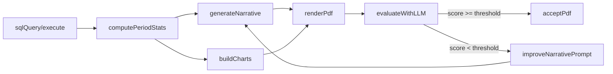

# Upgrade Reporting PDF Aesthetics and Layout

## Goals

- **Executive-quality layout**: Text pages read like a consulting report, with clear hierarchy (title, headings, subheadings, body), no visual Markdown artifacts, and no text overflowing off-page.
- **Consistent, polished charts**: All charts use a unified Seaborn/Matplotlib theme with an executive-friendly palette, typography, and spacing, and are visually tied to the narrative.
- **Structured report flow**: Each PDF follows a predictable, aesthetic structure (cover, executive summary, key insights with linked charts, appendix if needed).

## High-level architecture

- **Narrative generation** (e.g. `[tools/data_generation/report_generation/tools_narrative.py]` and category reports like `[tools/data_generation/report_generation/sales_performance_report.py]`) will continue to produce structured text but will be slightly adjusted to:
  - Emit explicit section markers (e.g., logical paragraph groups or headings) where useful.
  - Avoid over-long monolithic paragraphs that cause dense pages.
- **PDF assembly** (`[tools/data_generation/report_generation/pdf_utils.py]`, `[tools/data_generation/report_generation/tools_pdf.py]`) will be enhanced to:
  - Support multi-page narrative layout with line wrapping and pagination instead of forcing everything onto a single text figure.
  - Support simple heading/subheading styling (font size/weight, spacing) independent of any Markdown syntax.
- **Chart generation** (`[tools/data_generation/report_generation/tools_charts.py]` and the `build_period_figures` methods in each report module) will:
  - Use a shared Seaborn theme and style helper.
  - Produce charts with consistent sizes, titles, and annotations explicitly aligned with the narrative sections.
- **LLM-based evaluation and improvement loop** (`[tools/data_generation/report_generation/llm_client.py]` and new helper functions) will:
  - Evaluate each generated report against an executive-ready rubric.
  - Optionally rewrite and regenerate the narrative (and PDF layout) when quality falls below a configurable threshold.

A simplified data flow remains the same:

## Detailed steps

### 1. Define an executive Seaborn/Matplotlib theme

- **Create a shared style helper** in a new module, for example `[tools/data_generation/report_generation/chart_style.py]`:
  - `apply_executive_theme()` that sets:
    - Seaborn style (e.g., `whitegrid`) and context (`talk` or `paper`) for executive reports.
    - A muted but professional color palette (e.g., blues/greys for main series, accent color for highlights).
    - Matplotlib rcParams for font family, base sizes, and figure background.
  - Helper functions for consistent labels and titles (e.g., `format_axis_labels(ax)` for label case, tick rotation, and tight layout).
- **Integrate theme into existing charts**:
  - In `[tools/data_generation/report_generation/tools_charts.py]`, call `apply_executive_theme()` before any figures are created.
  - In each `build_period_figures` implementation (starting with `[tools/data_generation/report_generation/sales_performance_report.py]` and then propagating to other report modules), remove ad-hoc styling and rely on the shared theme while still setting chart-specific titles and labels.

### 2. Improve chart composition and linkage to narrative

- **Structure charts by narrative section**:
  - For each category report, review `build_period_figures` and ensure that each figure directly supports a key narrative point (e.g., “Top 10 stores”, “Channel mix”).
  - Standardize figure ordering (e.g., high-level KPIs first, then dimensional breakdowns) and ensure titles clearly express the insight.
- **Tighten layout and avoid clutter**:
  - Ensure each figure uses `bbox_inches="tight"` and appropriate aspect ratios (e.g., 8x4 or 8x5) so labels and legends don’t get cut off.
  - Apply consistent legend placement (e.g., outside or top-right) and limit the number of categories shown (e.g., top N) to prevent unreadable bars.
- **Add minimal annotations where high value**:
  - For key executive charts (like top stores or channels), add value labels or highlight the top contributor with a distinct color from the palette.

### 3. Redesign narrative layout to avoid overflow and noise

- **Refine narrative text structure**:
  - Keep the existing narrative content generation but:
    - Encourage paragraph breaks after 3–4 sentences when composing narratives in category modules so the text is not a wall of words.
    - Avoid unnecessary Markdown emphasis; rely on typography in the PDF instead.
- **Upgrade PDF text layout** in `[tools/data_generation/report_generation/pdf_utils.py]` and `[tools/data_generation/report_generation/tools_pdf.py]`:
  - Replace the single `create_text_page` call with a new layout function that:
    - Measures text blocks and splits long narratives into multiple pages based on character or line count thresholds, so no page is overcrowded.
    - Supports a simple heading hierarchy:
      - Report title at the top of page 1 (large, bold).
      - "Executive Summary" heading for the main narrative.
      - Optional subheadings like "Key Drivers", "Risks and Gaps", "Recommendations" using consistent font sizes and spacing.
  - Implement a small text-wrapping and pagination helper that:
    - Accepts the narrative string and splits it into paragraphs (by blank lines).
    - Packs paragraphs into pages until a maximum line count is reached, then starts a new page.
    - Places a footer marker or page counter in a subtle location if needed.

### 4. Organize plots and pages into a coherent report structure

- **Define a standard page sequence** in `render_pdf`:
  - Page 1: cover/summary page
    - Title line (category, granularity, period label, dates).
    - Executive summary narrative.
  - Pages 2–N: key insights with charts
    - For each chart, optionally reserve a short caption or bullet list under the figure to tie it back to a narrative point.
  - Optional final page: short appendix or “Notes and assumptions” if the narrative runs long.
- **Link charts to narrative sections**:
  - In `render_pdf`, align charts with the sections they relate to, either by ordering or by adding concise captions using the same font styling system.

### 5. Ensure headers, subheaders, and typography are consistent

- **Create simple layout primitives** in `pdf_utils`:
  - Functions like `draw_title(fig, text)`, `draw_heading(fig, text, y)`, and `draw_body_text(fig, text, y_start)` that:
    - Use consistent font sizes and weights for each level.
    - Enforce uniform margins (top, bottom, left, right) and spacing between sections.
- **Apply these primitives** in `create_text_page` (or its replacement) so that headers/subheaders are visually distinct without relying on Markdown markers (`*`*,`#`).

### 6. Add LLM-based PDF quality verification

- **Define an evaluation rubric and config**:
  - Extend `[tools/data_generation/report_generation/llm_config.yaml]` (or a dedicated config file) with:
    - `evaluation_system_prompt`: instructions describing how to rate report quality.
    - `evaluation_min_score`: numeric threshold for acceptable reports (e.g., 0–10 scale).
    - `rewrite_system_prompt`: instructions for rewriting narratives based on evaluator feedback.
    - Optional fields such as `max_regeneration_attempts`, `evaluation_model`, and feature flags to enable/disable evaluation.
- **Implement evaluation helper**:
  - Add a function in `[tools/data_generation/report_generation/llm_client.py]`, for example `evaluate_report_quality(...)`, that:
    - Accepts report metadata (category, granularity, period), narrative text, and chart descriptions.
    - Calls the configured LLM with the evaluation system prompt and returns a numeric score plus structured feedback (strengths, weaknesses, improvement suggestions).
- **Integrate evaluation into the workflow**:
  - After `render_pdf` in `[tools/data_generation/report_generation/workflow_graph.py]`, add a logical step that:
    - Calls `evaluate_report_quality` when the evaluation feature flag is enabled.
    - Stores the score and feedback in the `ReportState` alongside the `pdf_path`.

### 7. Add an automatic regeneration loop based on LLM feedback

- **Decision and retry logic**:
  - If the evaluation score ≥ `evaluation_min_score`, accept the PDF as final.
  - If the score < threshold and the number of attempts is below `max_regeneration_attempts`:
    - Call a new helper (e.g., `rewrite_report_narrative(...)` in `llm_client.py`) that:
      - Uses the rewrite system prompt, the original narrative, stats summary, and evaluator feedback to produce an improved narrative.
    - Regenerate the narrative pages (and optionally the full PDF) using the new text.
    - Optionally re-run the evaluator and keep the best-scoring version.
- **State tracking**:
  - Track attempt count and best score in `ReportState` to avoid infinite loops and to record which version was accepted.

### 8. Testing and iteration

- **Visual regression checks**:
  - Regenerate a small set of representative reports (e.g., monthly `sales`, `financial`, `customer`) for a known date range and manually inspect the PDFs for:
    - No text overflow or clipped paragraphs.
    - Consistent fonts, colors, and chart layouts.
    - Clear section hierarchy and linkage between text and visuals.
- **Automated sanity tests**:
  - Extend or add tests in `tests/test_report_`* and `tests/test_report_workflow_tools.py` to assert that:
    - `build_charts` returns at least one chart for non-empty data.
    - `render_pdf` successfully creates a multi-page PDF (size > 0, page count ≥ 2) for typical periods.
    - The narrative splitting logic produces multiple pages for very long narratives without raising errors.
    - The evaluation and regeneration helpers can be called with mocked LLM responses and correctly update `ReportState` according to score and thresholds.

## Todos

- **define-executive-chart-theme**: Create an `chart_style.py` module and apply the executive Seaborn/Matplotlib theme across all report categories.
- **refine-narrative-layout**: Enhance `pdf_utils.py` and `tools_pdf.py` to support multi-page narrative layout with clear headings, subheadings, and pagination.
- **structure-report-sequence**: Standardize the page order in `render_pdf` (cover, executive summary, insights with charts, optional appendix) and ensure charts include optional captions.
- **expand-tests-for-layout**: Add or extend tests to cover chart generation, PDF creation, and narrative pagination for representative categories and date ranges.
