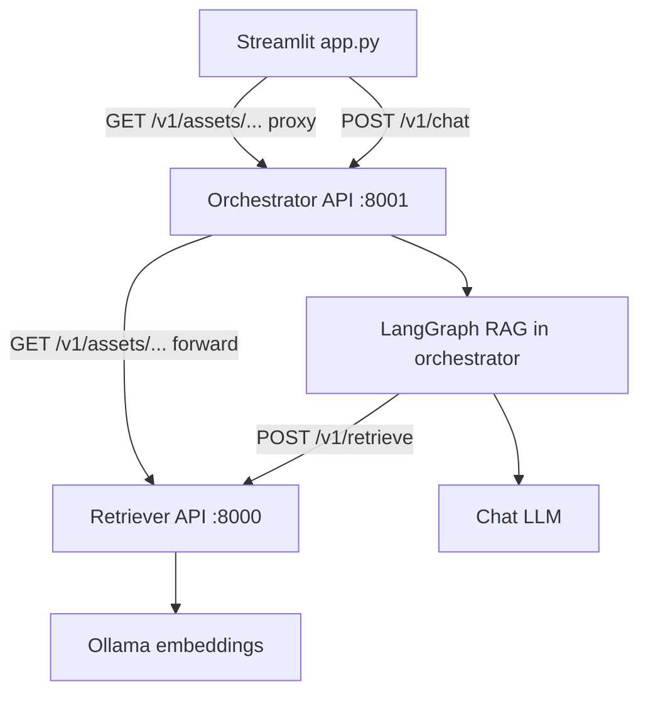
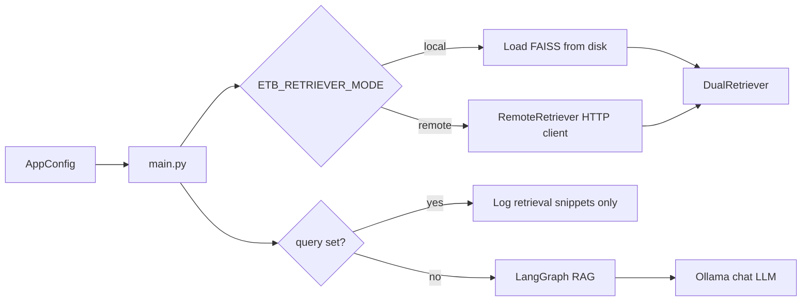

# Architecture Documentation

## Overview

ETB-project separates **index building** (document processing + persisted vector stores) from **runtime querying** (RAG orchestration). Runtime querying can run either:

- **Local mode**: load persisted indices and retrieve in-process (developer workflow)
- **Remote mode**: call a **standalone retriever HTTP API** for retrieval and indexing (deployment workflow)

This keeps the RAG layer flexible while the retriever can be deployed/scaled as a separate unit.

For operational “how-to” instructions, see the guides in [`docs/README.md`](README.md).

## Project structure

Repository layout (paths relative to repo root):

```
ETB-Project/
├── app.py                      # Streamlit UI → Orchestrator `POST /v1/chat`
├── docker-compose.yml          # UI + orchestrator + retriever + Ollama
├── Dockerfile
├── Makefile
├── pyproject.toml
├── requirements.txt
├── requirements-dev.txt
├── src/
│   ├── config/
│   │   └── settings.yaml       # Primary YAML (override with ETB_CONFIG)
│   └── etb_project/            # Installed package (`pip install -e .`)
│       ├── config.py           # AppConfig, load_config
│       ├── main.py             # CLI RAG (local or remote retriever)
│       ├── models.py           # LLM + embedding helpers
│       ├── graph_rag.py        # LangGraph RAG graph
│       ├── api/                # Retriever FastAPI (retrieve, index, assets)
│       ├── orchestrator/       # Orchestrator FastAPI (chat, asset proxy)
│       ├── ui/                 # Shared UI helpers (asset paths, headers)
│       ├── document_processing/
│       ├── document_processor_cli.py
│       ├── retrieval/          # Dual retriever + RemoteRetriever client
│       └── vectorstore/        # FAISS backends + indexing service
├── tools/                      # Not installed with the package
│   └── data_generation/
├── tests/
├── docs/
└── data/                       # Uploads, document_output, vector indices (typical)
```

Code under `tools/` is **not** part of the installed package. See [`TOOLS.md`](TOOLS.md).

## Design principles

### 1. Modularity
- Code is organized into logical modules
- Each module has a single responsibility
- Clear separation of concerns

### 2. Type safety
- Type hints throughout the codebase
- Static type checking with MyPy
- Runtime type validation where needed

### 3. Testability
- Dependency injection for testability
- Mock-friendly design
- Comprehensive test coverage

### 4. Scalability
- Designed for horizontal scaling
- Stateless services where possible
- Efficient resource usage

## Core components

### Main application (`etb_project.main`)

- Loads configuration from `src/config/settings.yaml` (or `ETB_CONFIG`)
- Uses **local** or **remote** retrieval via `ETB_RETRIEVER_MODE` and `RETRIEVER_BASE_URL`
- If **`query`** is set: **retrieval only** (logs document snippets; no LangGraph, no LLM)
- If **`query`** is empty: **interactive LangGraph** loop; chat LLM is **Ollama** via `get_ollama_llm()` (not `get_chat_llm()` / OpenRouter — those are used by the **Orchestrator API**)

### Runtime services (Docker / production-style)



- **Orchestrator** (`etb_project.orchestrator`): session chat, LangGraph RAG, calls the retriever for context, proxies `GET /v1/assets/{path}` to the retriever for UI image/artifact bytes.
- **Retriever** (`etb_project.api`): dual FAISS retrieval, PDF indexing, serves files from `ETB_DOCUMENT_OUTPUT_DIR` under `/v1/assets/...`.
- **UI** (`app.py`): talks only to the orchestrator (chat + assets).

### CLI / developer flow (no HTTP retriever)



- **Config** (`etb_project.config`): `AppConfig` — `pdf`, `query`, `retriever_k`, `log_level`, `vector_store_path`, captioning keys.
- **Remote retriever client** (`etb_project.retrieval.remote_retriever.RemoteRetriever`): `POST /v1/retrieve` to the retriever service.
- **LangGraph RAG** (`etb_project.graph_rag`): used only in **interactive** mode; paired with **Ollama** chat in `main`, not with `get_chat_llm()` (orchestrator uses `get_chat_llm()` for OpenAI-compat / OpenRouter).

### Standalone retriever API

Exposes:

- `GET /v1/health`, `GET /v1/ready`
- `POST /v1/retrieve` — chunks with JSON-safe metadata (including nested fields like `image_captions`)
- `POST /v1/index/documents` — multipart PDF upload; optional async job + `GET /v1/jobs/{job_id}`
- `GET /v1/assets/{asset_path}` — files under `ETB_DOCUMENT_OUTPUT_DIR` (optional bearer auth)

The RAG graph does **not** run inside this service. Point the orchestrator or CLI at it with:

- `ETB_RETRIEVER_MODE=remote`
- `RETRIEVER_BASE_URL=http://<host>:8000`

### Index building (offline / batch)

Separate workflow (CLI or API) that extracts text/images, optional captioning, builds/persists vector indices. See:

- [`DOCUMENT_PROCESSING.md`](DOCUMENT_PROCESSING.md)
- [`CLI_REFERENCE.md`](CLI_REFERENCE.md)
- [`IMAGE_CAPTIONING.md`](IMAGE_CAPTIONING.md)

## Development and operations

- [`DEVELOPMENT.md`](DEVELOPMENT.md)

## Related docs

- [`README.md`](README.md) (index)
- [`APP_RUN_MODES.md`](APP_RUN_MODES.md)
- [`CONFIGURATION.md`](CONFIGURATION.md)
- [`RETRIEVER_API.md`](RETRIEVER_API.md)
- [`ORCHESTRATOR_API.md`](ORCHESTRATOR_API.md)
- [`USAGE.md`](USAGE.md)
- [`DOCUMENT_PROCESSING.md`](DOCUMENT_PROCESSING.md)
- [`IMAGE_CAPTIONING.md`](IMAGE_CAPTIONING.md)
- [`TOOLS.md`](TOOLS.md)

## References

- [Python Packaging User Guide](https://packaging.python.org/)
- [PEP 8 Style Guide](https://pep8.org/)
- [Python Type Hints](https://docs.python.org/3/library/typing.html)
- [Pytest Documentation](https://docs.pytest.org/)
