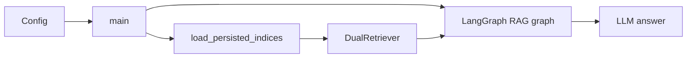

# Architecture Documentation

## Overview

ETB-project separates **index building** (document processing + persisted vector stores) from **runtime querying** (load persisted indices and run RAG). This keeps the main application fast and repeatable: you rebuild/update indices only when the underlying documents change.

For operational “how-to” instructions, see the guides in [`docs/README.md`](README.md).

## Project Structure

```
etb_project/
├── src/
│   ├── config/
│   │   └── settings.yaml        # App config (pdf/query/retriever_k/log_level/vector_store_path + captioning models)
│   └── etb_project/
│       ├── __init__.py
│       ├── config.py            # AppConfig, load_config (reads settings.yaml or ETB_CONFIG)
│       ├── main.py              # Entry point: load persisted indices; single-query or interactive RAG loop
│       ├── models.py            # LLM and embedding helpers
│       ├── graph_rag.py         # LangGraph RAG graph (ingest_query → retrieve_rag → generate_answer)
│       ├── document_processor_cli.py  # CLI for extraction/chunking/indexing/persistence
│       ├── document_processing/ # PDF extraction, chunking, and optional image captioning
│       ├── retrieval/           # Retrieval adapters and orchestration (including dual retrieval)
│       └── vectorstore/         # Vector store backends + indexing service (persist/load)
├── tools/                       # Utilities and side projects (not installed)
│   └── data_generation/
├── tests/                       # test_config, test_main, test_retrieval_process
├── docs/
└── .github/
```

### Tools and utilities

Code under `tools/` is **not** part of the installed package. Only `src/etb_project/` is packaged and installed. The `tools/` directory holds development and one-off utilities (e.g. data generation, standalone captioning) that are run from the repo. See [`TOOLS.md`](TOOLS.md).

## Design Principles

### 1. Modularity
- Code is organized into logical modules
- Each module has a single responsibility
- Clear separation of concerns

### 2. Type Safety
- Type hints throughout the codebase
- Static type checking with MyPy
- Runtime type validation where needed

### 3. Testability
- Dependency injection for testability
- Mock-friendly design
- Comprehensive test coverage

### 4. Scalability
- Designed for horizontal scaling
- Stateless services where possible
- Efficient resource usage

## Core Components

### Main Application

The main application entry point is in `src/etb_project/main.py`. This module:

- Loads configuration from `src/config/settings.yaml` (or `ETB_CONFIG` path)
- Sets log level from config
- Loads persisted vector indices from `vector_store_path`
- Runs a single query if `config.query` is set, otherwise enters an interactive query loop

### RAG pipeline



- **Config** (`etb_project.config`): `AppConfig` holds runtime keys like `pdf`, `query`, `retriever_k`, `log_level`, and paths like `vector_store_path`.
- **Index load** (`etb_project.vectorstore`): loads the persisted vector indices that were built during document processing.
- **Retriever** (`etb_project.retrieval.dual_retriever.DualRetriever`): merges/de-duplicates results from the text index and caption index.
- **LangGraph RAG graph** (`etb_project.graph_rag`): orchestrates `ingest_query → retrieve_rag → generate_answer`.

### Index building (offline step)

Index building is a separate workflow (CLI or programmatic) that:

- extracts text and images from PDFs
- writes artifacts (`pages.json`, `chunks.jsonl`, `images/`)
- optionally captions images
- builds/persists vector indices

This is intentionally separated from runtime querying so that `main` can stay load-only.

See:

- [`DOCUMENT_PROCESSING.md`](DOCUMENT_PROCESSING.md)
- [`CLI_REFERENCE.md`](CLI_REFERENCE.md)
- [`IMAGE_CAPTIONING.md`](IMAGE_CAPTIONING.md)

## Development and operations

The development workflow, linting/type-checking, and Docker usage are documented separately:

- [`DEVELOPMENT.md`](DEVELOPMENT.md)

## Related docs

- [`USAGE.md`](USAGE.md)
- [`CONFIGURATION.md`](CONFIGURATION.md)
- [`DOCUMENT_PROCESSING.md`](DOCUMENT_PROCESSING.md)
- [`IMAGE_CAPTIONING.md`](IMAGE_CAPTIONING.md)
- [`TOOLS.md`](TOOLS.md)

## References

- [Python Packaging User Guide](https://packaging.python.org/)
- [PEP 8 Style Guide](https://pep8.org/)
- [Python Type Hints](https://docs.python.org/3/library/typing.html)
- [Pytest Documentation](https://docs.pytest.org/)
