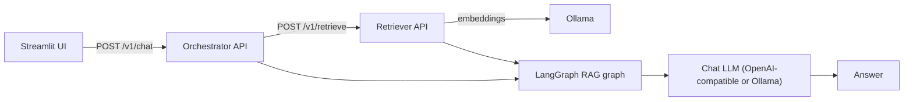

# Architecture Documentation

## Overview

ETB-project separates **index building** (document processing + persisted vector stores) from **runtime querying** (RAG orchestration). Runtime querying can run either:

- **Local mode**: load persisted indices and retrieve in-process (developer workflow)
- **Remote mode**: call a **standalone retriever HTTP API** for retrieval and indexing (deployment workflow)

This keeps the RAG layer flexible while the retriever can be deployed/scaled as a separate unit.

For operational “how-to” instructions, see the guides in [`docs/README.md`](README.md).

## Project Structure

```
ETB-Project/
├── app.py                      # Streamlit UI (calls orchestrator)
├── docker-compose.yml          # UI + orchestrator + retriever (+ Ollama)
├── docs/
├── data/                       # Persisted artifacts (uploads, outputs, vector indices)
├── tools/                      # Utilities and side projects (not installed)
├── tests/
└── src/
    ├── config/
    │   └── settings.yaml
    └── etb_project/
        ├── api/                # Retriever API (indexing + retrieve; no RAG graph)
        ├── orchestrator/       # Orchestrator API (chat; runs LangGraph RAG)
        ├── retrieval/          # Dual/local + remote retriever client
        ├── vectorstore/        # FAISS persistence/indexing backends
        ├── document_processing/
        ├── document_processor_cli.py
        ├── graph_rag.py
        ├── main.py             # CLI RAG (local or remote retriever)
        └── models.py           # Chat LLM provider selection + Ollama embeddings wrapper
```

### Tools and utilities

Code under `tools/` is **not** part of the installed package. Only `src/etb_project/` is packaged and installed. The `tools/` directory holds development and one-off utilities (e.g. data generation, standalone captioning) that are run from the repo. See [`TOOLS.md`](TOOLS.md).

## Design Principles

### 1. Modularity
- Code is organized into logical modules
- Each module has a single responsibility
- Clear separation of concerns

### 2. Type Safety
- Type hints throughout the codebase
- Static type checking with MyPy
- Runtime type validation where needed

### 3. Testability
- Dependency injection for testability
- Mock-friendly design
- Comprehensive test coverage

### 4. Scalability
- Designed for horizontal scaling
- Stateless services where possible
- Efficient resource usage

## Core Components

### Main Application

The main application entry point is in `src/etb_project/main.py`. This module:

- Loads configuration from `src/config/settings.yaml` (or `ETB_CONFIG` path)
- Sets log level from config
- Uses **local** or **remote** retrieval (via `ETB_RETRIEVER_MODE`)
- Runs a single query if `config.query` is set, otherwise enters an interactive query loop

### RAG pipeline



- **Config** (`etb_project.config`): `AppConfig` holds runtime keys like `pdf`, `query`, `retriever_k`, `log_level`, and paths like `vector_store_path`.
- **Retriever API** (`etb_project.api`): indexing + retrieval endpoints; persists vector indices and serves retrieval.
- **Remote retriever client** (`etb_project.retrieval.remote_retriever.RemoteRetriever`): orchestrator/CLI client for `POST /v1/retrieve`.
- **LangGraph RAG graph** (`etb_project.graph_rag`): orchestrates `ingest_query → retrieve_rag → generate_answer`.
- **UI** (`app.py`): sends chat messages to the orchestrator; renders answers and optional sources.

### Standalone retriever API (optional)

The retriever API exposes:

- `POST /v1/retrieve`: returns retrieved chunks (content + metadata)
- `POST /v1/index/documents`: upload PDFs and update the persisted dual index

The RAG layer remains outside of this service. The orchestrator can switch to remote mode using:

- `ETB_RETRIEVER_MODE=remote`
- `RETRIEVER_BASE_URL=http://<host>:8000`

### Index building (offline step)

Index building is a separate workflow (CLI or programmatic) that:

- extracts text and images from PDFs
- writes artifacts (`pages.json`, `chunks.jsonl`, `images/`)
- optionally captions images
- builds/persists vector indices

This is intentionally separated from runtime querying so that `main` can stay load-only.

See:

- [`DOCUMENT_PROCESSING.md`](DOCUMENT_PROCESSING.md)
- [`CLI_REFERENCE.md`](CLI_REFERENCE.md)
- [`IMAGE_CAPTIONING.md`](IMAGE_CAPTIONING.md)

## Development and operations

The development workflow, linting/type-checking, and Docker usage are documented separately:

- [`DEVELOPMENT.md`](DEVELOPMENT.md)

## Related docs

- [`USAGE.md`](USAGE.md)
- [`CONFIGURATION.md`](CONFIGURATION.md)
- [`DOCUMENT_PROCESSING.md`](DOCUMENT_PROCESSING.md)
- [`IMAGE_CAPTIONING.md`](IMAGE_CAPTIONING.md)
- [`TOOLS.md`](TOOLS.md)

## References

- [Python Packaging User Guide](https://packaging.python.org/)
- [PEP 8 Style Guide](https://pep8.org/)
- [Python Type Hints](https://docs.python.org/3/library/typing.html)
- [Pytest Documentation](https://docs.pytest.org/)
